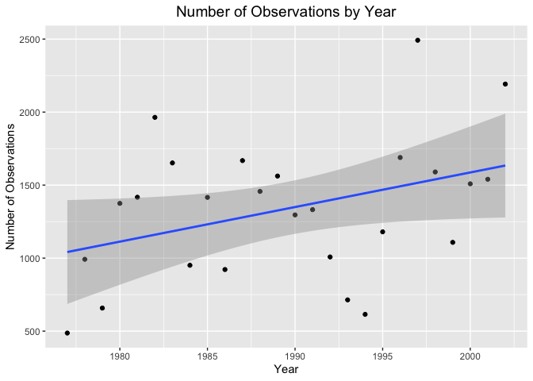
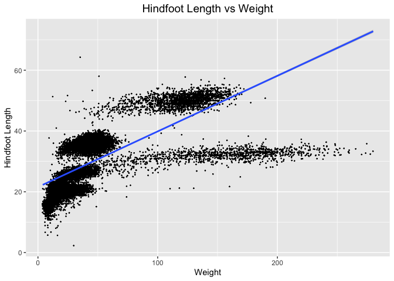

## Instructions   

Answer the following questions and complete the exercises in RMarkdown. Please embed all of your code and push your final work to your repository. Your final lab report should be organized, clean, and run free from errors. Remember, you must remove the `#` for the included code chunks to run. Be sure to add your name to the author header above. For any included plots, make sure they are clearly labeled. You are free to use any plot type that you feel best communicates the results of your analysis.  

Make sure to use the formatting conventions of RMarkdown to make your report neat and clean!  

## Load the libraries    


```r
library(tidyverse)
library(janitor)
library(naniar)
```

## Desert Ecology    

For this assignment, we are going to use a modified data set on [desert ecology](http://esapubs.org/archive/ecol/E090/118/). The data are from: S. K. Morgan Ernest, Thomas J. Valone, and James H. Brown. 2009. Long-term monitoring and experimental manipulation of a Chihuahuan Desert ecosystem near Portal, Arizona, USA. Ecology 90:1708.

```r
deserts <- read_csv("data/surveys_complete.csv") %>% clean_names()
```

```
## Rows: 34786 Columns: 13
## ── Column specification ────────────────────────────────────────────────────────
## Delimiter: ","
## chr (6): species_id, sex, genus, species, taxa, plot_type
## dbl (7): record_id, month, day, year, plot_id, hindfoot_length, weight
## 
## ℹ Use `spec()` to retrieve the full column specification for this data.
## ℹ Specify the column types or set `show_col_types = FALSE` to quiet this message.
```

### 1. Use the function(s) of your choice to get an idea of its structure, including how NA's are treated. Are the data tidy?   

#### Structure of `deserts` data set:    


```r
glimpse(deserts)
```

```
## Rows: 34,786
## Columns: 13
## $ record_id       <dbl> 1, 2, 3, 4, 5, 6, 7, 8, 9, 10, 11, 12, 13, 14, 15, 16,…
## $ month           <dbl> 7, 7, 7, 7, 7, 7, 7, 7, 7, 7, 7, 7, 7, 7, 7, 7, 7, 7, …
## $ day             <dbl> 16, 16, 16, 16, 16, 16, 16, 16, 16, 16, 16, 16, 16, 16…
## $ year            <dbl> 1977, 1977, 1977, 1977, 1977, 1977, 1977, 1977, 1977, …
## $ plot_id         <dbl> 2, 3, 2, 7, 3, 1, 2, 1, 1, 6, 5, 7, 3, 8, 6, 4, 3, 2, …
## $ species_id      <chr> "NL", "NL", "DM", "DM", "DM", "PF", "PE", "DM", "DM", …
## $ sex             <chr> "M", "M", "F", "M", "M", "M", "F", "M", "F", "F", "F",…
## $ hindfoot_length <dbl> 32, 33, 37, 36, 35, 14, NA, 37, 34, 20, 53, 38, 35, NA…
## $ weight          <dbl> NA, NA, NA, NA, NA, NA, NA, NA, NA, NA, NA, NA, NA, NA…
## $ genus           <chr> "Neotoma", "Neotoma", "Dipodomys", "Dipodomys", "Dipod…
## $ species         <chr> "albigula", "albigula", "merriami", "merriami", "merri…
## $ taxa            <chr> "Rodent", "Rodent", "Rodent", "Rodent", "Rodent", "Rod…
## $ plot_type       <chr> "Control", "Long-term Krat Exclosure", "Control", "Rod…
```

#### How NA's are treated:    

It appears that the NA's are already represented by NA.    


```r
miss_var_summary(deserts)
```

```
## # A tibble: 13 × 3
##    variable        n_miss pct_miss
##    <chr>            <int>    <dbl>
##  1 hindfoot_length   3348     9.62
##  2 weight            2503     7.20
##  3 sex               1748     5.03
##  4 record_id            0     0   
##  5 month                0     0   
##  6 day                  0     0   
##  7 year                 0     0   
##  8 plot_id              0     0   
##  9 species_id           0     0   
## 10 genus                0     0   
## 11 species              0     0   
## 12 taxa                 0     0   
## 13 plot_type            0     0
```


```r
summary(deserts)
```

```
##    record_id         month             day            year         plot_id     
##  Min.   :    1   Min.   : 1.000   Min.   : 1.0   Min.   :1977   Min.   : 1.00  
##  1st Qu.: 8964   1st Qu.: 4.000   1st Qu.: 9.0   1st Qu.:1984   1st Qu.: 5.00  
##  Median :17762   Median : 6.000   Median :16.0   Median :1990   Median :11.00  
##  Mean   :17804   Mean   : 6.474   Mean   :16.1   Mean   :1990   Mean   :11.34  
##  3rd Qu.:26655   3rd Qu.:10.000   3rd Qu.:23.0   3rd Qu.:1997   3rd Qu.:17.00  
##  Max.   :35548   Max.   :12.000   Max.   :31.0   Max.   :2002   Max.   :24.00  
##                                                                                
##   species_id            sex            hindfoot_length     weight      
##  Length:34786       Length:34786       Min.   : 2.00   Min.   :  4.00  
##  Class :character   Class :character   1st Qu.:21.00   1st Qu.: 20.00  
##  Mode  :character   Mode  :character   Median :32.00   Median : 37.00  
##                                        Mean   :29.29   Mean   : 42.67  
##                                        3rd Qu.:36.00   3rd Qu.: 48.00  
##                                        Max.   :70.00   Max.   :280.00  
##                                        NA's   :3348    NA's   :2503    
##     genus             species              taxa            plot_type        
##  Length:34786       Length:34786       Length:34786       Length:34786      
##  Class :character   Class :character   Class :character   Class :character  
##  Mode  :character   Mode  :character   Mode  :character   Mode  :character  
##                                                                             
##                                                                             
##                                                                             
## 
```

#### Determining whether the data is tidy:   

#### The data does appear to be tidy, since the variables have their own columns, each observation has its own row, and each value has its own cell.        


```r
deserts
```

```
## # A tibble: 34,786 × 13
##    record_id month   day  year plot_id species_id sex   hindfoot_length weight
##        <dbl> <dbl> <dbl> <dbl>   <dbl> <chr>      <chr>           <dbl>  <dbl>
##  1         1     7    16  1977       2 NL         M                  32     NA
##  2         2     7    16  1977       3 NL         M                  33     NA
##  3         3     7    16  1977       2 DM         F                  37     NA
##  4         4     7    16  1977       7 DM         M                  36     NA
##  5         5     7    16  1977       3 DM         M                  35     NA
##  6         6     7    16  1977       1 PF         M                  14     NA
##  7         7     7    16  1977       2 PE         F                  NA     NA
##  8         8     7    16  1977       1 DM         M                  37     NA
##  9         9     7    16  1977       1 DM         F                  34     NA
## 10        10     7    16  1977       6 PF         F                  20     NA
## # ℹ 34,776 more rows
## # ℹ 4 more variables: genus <chr>, species <chr>, taxa <chr>, plot_type <chr>
```

### 2. How many genera and species are represented in the data? What are the total number of observations? Which species is most/ least frequently sampled in the study?    


```r
deserts %>% 
  summarise(n_genera = n_distinct(genus), #finding the number of distinct genera in the dataset
            n_species = n_distinct(species), #finding the number of distinct species in the dataset
            n_total_observations = n()) #finding the total number of observations in the dataset
```

```
## # A tibble: 1 × 3
##   n_genera n_species n_total_observations
##      <int>     <int>                <int>
## 1       26        40                34786
```

#### There are 26 distinct genera and 40 distinct species represented in the data.     

#### There are 34786 total observations in the `deserts` data set.   


```r
deserts %>% 
  count(species) %>% #finding number of observations for each species
  arrange(n) #arranging from lowest to highest number of observations
```

```
## # A tibble: 40 × 2
##    species          n
##    <chr>        <int>
##  1 clarki           1
##  2 scutalatus       1
##  3 tereticaudus     1
##  4 tigris           1
##  5 uniparens        1
##  6 viridis          1
##  7 leucophrys       2
##  8 savannarum       2
##  9 fuscus           5
## 10 undulatus        5
## # ℹ 30 more rows
```

#### Thus, the species is least frequently sampled in the study are Sceloporus clarki, Crotalus scutalatus, Spermophilus tereticaudus, Cnemidophorus tigris, Cnemidophorus uniparens, Crotalus viridis, each only represented 1 time in the data set.     


```r
deserts %>% 
  count(species) %>% #finding number of observations for each species
  arrange(desc(n)) #arranging from highest to lowest number of observations
```

```
## # A tibble: 40 × 2
##    species          n
##    <chr>        <int>
##  1 merriami     10596
##  2 penicillatus  3123
##  3 ordii         3027
##  4 baileyi       2891
##  5 megalotis     2609
##  6 spectabilis   2504
##  7 torridus      2249
##  8 flavus        1597
##  9 eremicus      1299
## 10 albigula      1252
## # ℹ 30 more rows
```

#### Thus, the species is most frequently sampled in the study is Dipodomys merriami, represented 10596 times in the data set.    

### 3. What is the proportion of taxa included in this study? Show a table and plot that reflects this count.    

#### Table of the proportion of taxa included in this study:    


```r
taxa_proportions <- deserts %>%
  tabyl(taxa) 
taxa_proportions
```

```
##     taxa     n      percent
##     Bird   450 0.0129362387
##   Rabbit    75 0.0021560398
##  Reptile    14 0.0004024608
##   Rodent 34247 0.9845052607
```

#### Plot that represents the proportion of taxa included in this study:   


```r
taxa_proportions %>% 
  ggplot(aes(x = taxa, y = n, fill = taxa)) + #creating the plot
  geom_col() + #creating a bar plot
  scale_y_log10() + #for ease of viewing
  labs(title = "Taxa Represented in Study",
       x = "Taxa",
       y = "Number of Observations",
       fill = "Taxa") + #adding labels
  theme(plot.title = element_text(size = rel(1.3), hjust = 0.5)) #moving and resizing labels to desired size and location
```

<!-- -->


```r
taxa_proportions %>% 
  ggplot(aes(x = taxa, y = percent, fill = taxa)) + #creating the plot
  geom_col() + #creating a bar plot
  labs(title = "Taxa Represented in Study",
       x = "Taxa",
       y = "Proportion",
       fill = "Taxa") + #adding labels
  theme(plot.title = element_text(size = rel(1.3), hjust = 0.5)) #moving and resizing labels to desired size and location
```

<!-- -->

### 4. For the taxa included in the study, use the fill option to show the proportion of individuals sampled by `plot_type.`    


```r
deserts %>% 
  ggplot(aes(x = taxa, fill = plot_type)) + #creating the plot
  geom_bar() + #creating a bar plot
  scale_y_log10() + #for ease of viewing
  labs(title = "Taxa Represented in Study",
       x = "Taxa",
       y = "Number of Observations",
       fill = "Type of Plot") + #adding labels
  theme(plot.title = element_text(size = rel(1.3), hjust = 0.5)) #moving and resizing labels to desired size and location
```

<!-- -->

### 5. What is the range of weight for each species included in the study? Remove any observations of weight that are NA so they do not show up in the plot.    


```r
deserts %>% 
  filter(weight != "NA") %>% #removing any observations of weight NA 
  unite(species_name, "genus", "species", sep=" ") %>% 
  ggplot(aes(x = species_name, y = weight)) + #creating the plot
  geom_boxplot() + #creating a boxplot
  coord_flip() + #flipping the axes for ease of viewing
  labs(title = "Weight by Species",
       x = "Weight",
       y = "Species Name") + #adding labels
  theme(plot.title = element_text(size = rel(1.3), hjust = 0.5)) #moving and resizing labels to desired size and location
```

<!-- -->

### 6. Add another layer to your answer from #5 using `geom_point` to get an idea of how many measurements were taken for each species.    


```r
deserts %>% 
  filter(weight != "NA") %>% #removing any observations of weight NA 
  unite(species_name, "genus", "species", sep=" ") %>% #combining the genus and species names
  ggplot(aes(x = species_name, y = weight)) + #creating the plot
  geom_boxplot() + #creating a boxplot
  coord_flip() + #flipping the axes for ease of viewing
  labs(title = "Weight by Species",
       x = "Weight",
       y = "Species Name") + #adding labels
  theme(plot.title = element_text(size = rel(1.3), hjust = 0.5)) + #moving and resizing labels to desired size and location
  geom_point(aes(color = weight), size = 0.5) #adding scatterplot
```

<!-- -->

### 7. [Dipodomys merriami](https://en.wikipedia.org/wiki/Merriam's_kangaroo_rat) is the most frequently sampled animal in the study. How have the number of observations of this species changed over the years included in the study?    


```r
deserts %>% 
  filter(species == "merriami") %>% #filtering by Dipodomys merriami, the most frequently sample animal in the study
  group_by(year) %>% 
  summarize(n_observations = n()) #number of observations for each year
```

```
## # A tibble: 26 × 2
##     year n_observations
##    <dbl>          <int>
##  1  1977            264
##  2  1978            389
##  3  1979            209
##  4  1980            493
##  5  1981            559
##  6  1982            609
##  7  1983            528
##  8  1984            396
##  9  1985            667
## 10  1986            406
## # ℹ 16 more rows
```


```r
deserts %>% 
  ggplot(aes(x = year)) + #creating the plot
  geom_bar() + #creating the barplot
  labs(title = "Number of Observations by Year",
       x = "Year") + #adding labels
  theme(plot.title = element_text(size = rel(1.3), hjust = 0.5)) #resizing and moving labels
```

<!-- -->

Using a scatterplot to get an idea of the trend of sampling over the years:    


```r
deserts %>% 
  count(year) %>% #creating counts of observations by year
  ggplot(aes(x = year, y = n)) + #creating the plot
  geom_point() + #creating the scatterplot
  labs(title = "Number of Observations by Year",
       x = "Year",
       y = "Number of Observations") + #adding labels
  theme(plot.title = element_text(size = rel(1.3), hjust = 0.5)) + #resizing and moving labels
  geom_smooth(method = lm, se = T) #adding line of best fit
```

```
## `geom_smooth()` using formula = 'y ~ x'
```

<!-- -->

#### Based on the plot above, there appears to be a loose association between the years in which this data was collected and the number of observations. It appears that as time has passed, MORE observations have been made. In other words, as the number of observations of this species increased over the years included in the study.  

### 8. What is the relationship between `weight` and `hindfoot` length? Consider whether or not over plotting is an issue. 

#### It appears that as weight increases, so does hindfoot length, but based on the grouping of the data points that may not be a true association.      

#### Overplotting was clearly an issue, so I resolved this using the `geom_jitter()` argument.    


```r
deserts %>% 
  ggplot(aes(x = weight, y = hindfoot_length)) + #creating the plot
  geom_jitter() + #reducing overplotting
  labs(title = "Hindfoot Length vs Weight",
       x = "Weight",
       y = "Hindfoot Length") + #adding labels
  theme(plot.title = element_text(size = rel(1.3), hjust = 0.5)) + #moving and resizing the labels
  geom_smooth(method = lm, se = T) #adding a line of best fit
```

```
## `geom_smooth()` using formula = 'y ~ x'
```

```
## Warning: Removed 4048 rows containing non-finite values (`stat_smooth()`).
```

```
## Warning: Removed 4048 rows containing missing values (`geom_point()`).
```

<!-- -->

### 9. Which two species have, on average, the highest weight? Once you have identified them, make a new column that is a ratio of `weight` to `hindfoot_length`. Make a plot that shows the range of this new ratio and fill by sex.     


```r
deserts %>% 
  group_by(species) %>% 
  summarize(mean_weight = mean(weight, na.rm = T)) %>% #finding the average weights for each species
  arrange(desc(mean_weight)) %>% #arranging the data from highest to lowest highest weight
  head(2, species) #showing only the two species with the highest average weight
```

```
## # A tibble: 2 × 2
##   species     mean_weight
##   <chr>             <dbl>
## 1 albigula           159.
## 2 spectabilis        120.
```

#### Thus, the two species that have, on average, the highest weight are Neotoma albigula and Dipodomys spectabilis.    


```r
top_species_desert <- deserts %>% 
  filter(species == "albigula" | species == "spectabilis") %>% #filtering by the species with the highest average weights
  mutate(weight_to_hindfoot_length_ratio = weight / hindfoot_length) #adding the weight to hindfoot length ratio as a new column
deserts
```

```
## # A tibble: 34,786 × 13
##    record_id month   day  year plot_id species_id sex   hindfoot_length weight
##        <dbl> <dbl> <dbl> <dbl>   <dbl> <chr>      <chr>           <dbl>  <dbl>
##  1         1     7    16  1977       2 NL         M                  32     NA
##  2         2     7    16  1977       3 NL         M                  33     NA
##  3         3     7    16  1977       2 DM         F                  37     NA
##  4         4     7    16  1977       7 DM         M                  36     NA
##  5         5     7    16  1977       3 DM         M                  35     NA
##  6         6     7    16  1977       1 PF         M                  14     NA
##  7         7     7    16  1977       2 PE         F                  NA     NA
##  8         8     7    16  1977       1 DM         M                  37     NA
##  9         9     7    16  1977       1 DM         F                  34     NA
## 10        10     7    16  1977       6 PF         F                  20     NA
## # ℹ 34,776 more rows
## # ℹ 4 more variables: genus <chr>, species <chr>, taxa <chr>, plot_type <chr>
```


```r
top_species_desert %>% 
  filter(sex != "NA") %>% #removing NA's
  ggplot(aes(x = species, y = weight_to_hindfoot_length_ratio, fill = sex)) + #creating the plot
  geom_boxplot(alpha = 0.5) #creating the boxplot and making the boxes more transparent
```

```
## Warning: Removed 567 rows containing non-finite values (`stat_boxplot()`).
```

<!-- -->

### 10. Make one plot of your choice! Make sure to include at least two of the aesthetics options you have learned.    

#### The plot shows the range of weights for male versus female animals comparing the plot type.     


```r
deserts %>% 
  filter(sex != "NA") %>% #filtering out the NA's in the sex column
  ggplot(aes(x = sex, y = weight, fill = plot_type)) + #creating the plot
  geom_boxplot(alpha = 0.5) + #creating a boxplot
  labs(title = "Weight by Sex",
       x = "Sex",
       y = "Weight",
       fill = "Taxa") + #adding labels
  theme(plot.title = element_text(size = rel(1.3), hjust = 0.5)) + #moving and resizing labels
  scale_y_log10() #for ease of viewing
```

```
## Warning: Removed 856 rows containing non-finite values (`stat_boxplot()`).
```

<!-- -->

## Push your final code to GitHub!  
Please be sure that you check the `keep md` file in the knit preferences. 
