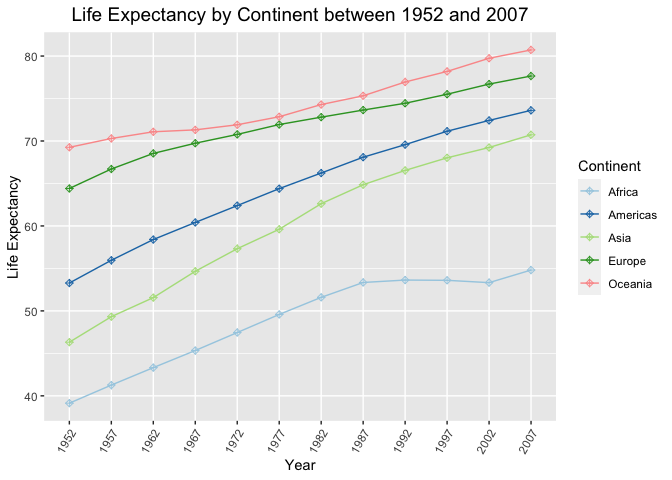
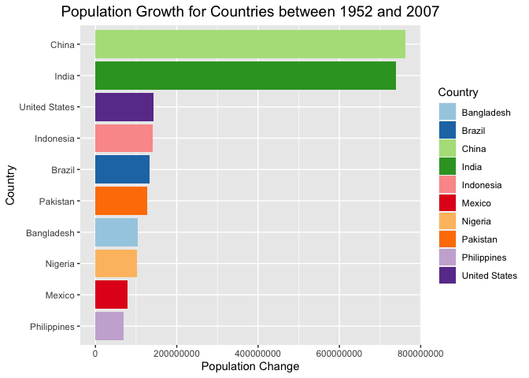

## Instructions
Answer the following questions and complete the exercises in RMarkdown. Please embed all of your code and push your final work to your repository. Your final lab report should be organized, clean, and run free from errors. Remember, you must remove the `#` for the included code chunks to run. Be sure to add your name to the author header above. For any included plots, make sure they are clearly labeled. You are free to use any plot type that you feel best communicates the results of your analysis.  

**In this homework, you should make use of the aesthetics you have learned. It's OK to be flashy!**

Make sure to use the formatting conventions of RMarkdown to make your report neat and clean!  

## Load the libraries

```r
library(tidyverse)
library(janitor)
library(here)
library(naniar)
```


```r
options(scipen = 999)
```

## Resources
The idea for this assignment came from [Rebecca Barter's](http://www.rebeccabarter.com/blog/2017-11-17-ggplot2_tutorial/) ggplot tutorial so if you get stuck this is a good place to have a look.  

## Gapminder
For this assignment, we are going to use the dataset [gapminder](https://cran.r-project.org/web/packages/gapminder/index.html). Gapminder includes information about economics, population, and life expectancy from countries all over the world. You will need to install it before use. This is the same data that we will use for midterm 2 so this is good practice.

```r
#install.packages("gapminder")
library("gapminder")
```


```r
gapminder <- gapminder
```

## Questions
The questions below are open-ended and have many possible solutions. Your approach should, where appropriate, include numerical summaries and visuals. Be creative; assume you are building an analysis that you would ultimately present to an audience of stakeholders. Feel free to try out different `geoms` if they more clearly present your results.  

### 1. Use the function(s) of your choice to get an idea of the overall structure of the data frame, including its dimensions, column names, variable classes, etc. As part of this, determine how NAs are treated in the data.    

#### Overall Structure of the Dataframe:   


```r
glimpse(gapminder)
```

```
## Rows: 1,704
## Columns: 6
## $ country   <fct> "Afghanistan", "Afghanistan", "Afghanistan", "Afghanistan", …
## $ continent <fct> Asia, Asia, Asia, Asia, Asia, Asia, Asia, Asia, Asia, Asia, …
## $ year      <int> 1952, 1957, 1962, 1967, 1972, 1977, 1982, 1987, 1992, 1997, …
## $ lifeExp   <dbl> 28.801, 30.332, 31.997, 34.020, 36.088, 38.438, 39.854, 40.8…
## $ pop       <int> 8425333, 9240934, 10267083, 11537966, 13079460, 14880372, 12…
## $ gdpPercap <dbl> 779.4453, 820.8530, 853.1007, 836.1971, 739.9811, 786.1134, …
```

#### `gapfinder` Dimensions are 6 variables (columns) 1704 observations (rows): 


```r
dim(gapminder)
```

```
## [1] 1704    6
```

#### `gapfinder` Column Names are "country", "continent", "year", "lifeExp", "pop", and "gdpPercap":    


```r
names(gapminder)
```

```
## [1] "country"   "continent" "year"      "lifeExp"   "pop"       "gdpPercap"
```

#### How NAs are treated in the data:

It appears that there are no NA's in the data, as there are no NA's or strange/unusual values that could be placeholder for NA's in the data.    


```r
miss_var_summary(gapminder)
```

```
## # A tibble: 6 × 3
##   variable  n_miss pct_miss
##   <chr>      <int>    <dbl>
## 1 country        0        0
## 2 continent      0        0
## 3 year           0        0
## 4 lifeExp        0        0
## 5 pop            0        0
## 6 gdpPercap      0        0
```


```r
summary(gapminder)
```

```
##         country        continent        year         lifeExp     
##  Afghanistan:  12   Africa  :624   Min.   :1952   Min.   :23.60  
##  Albania    :  12   Americas:300   1st Qu.:1966   1st Qu.:48.20  
##  Algeria    :  12   Asia    :396   Median :1980   Median :60.71  
##  Angola     :  12   Europe  :360   Mean   :1980   Mean   :59.47  
##  Argentina  :  12   Oceania : 24   3rd Qu.:1993   3rd Qu.:70.85  
##  Australia  :  12                  Max.   :2007   Max.   :82.60  
##  (Other)    :1632                                                
##       pop               gdpPercap       
##  Min.   :     60011   Min.   :   241.2  
##  1st Qu.:   2793664   1st Qu.:  1202.1  
##  Median :   7023596   Median :  3531.8  
##  Mean   :  29601212   Mean   :  7215.3  
##  3rd Qu.:  19585222   3rd Qu.:  9325.5  
##  Max.   :1318683096   Max.   :113523.1  
## 
```

### 2. Among the interesting variables in gapminder is life expectancy. How has global life expectancy changed between 1952 and 2007?      


```r
gapminder %>% 
  filter(year >= "1952", year <= "2007") %>% #making sure the data is within the desired time frame
  group_by(year) %>% #grouping by the variable "year"
  summarize(mean_life_expectancy = mean(lifeExp, na.rm = T)) #finding the global average life expectancy in each year
```

```
## # A tibble: 12 × 2
##     year mean_life_expectancy
##    <int>                <dbl>
##  1  1952                 49.1
##  2  1957                 51.5
##  3  1962                 53.6
##  4  1967                 55.7
##  5  1972                 57.6
##  6  1977                 59.6
##  7  1982                 61.5
##  8  1987                 63.2
##  9  1992                 64.2
## 10  1997                 65.0
## 11  2002                 65.7
## 12  2007                 67.0
```


```r
gapminder %>% 
  filter(year >= "1952", year <= "2007") %>% #making sure the data is within the desired time frame
  mutate(year = as.factor(year)) %>%
  group_by(year) %>% #grouping by the variable year
  summarise(mean_life_expectancy = mean(lifeExp, na.rm = T)) %>% #finding the global average life expectancy in each year
  ggplot(aes(x = year, y = mean_life_expectancy, fill = year)) + #creating the plot
  geom_col() + #creating a barplot
  scale_fill_brewer(palette = "Paired") + #choosing the color scheme
  theme(axis.text.x = element_text(angle = 60, hjust = 1)) + #angling the x axis text for ease of viewing
  labs(title = "Global Life Expectancy between 1952 to 2007",
       x = "Year",
       y = "Life Expectancy") + #adding labels
  theme(plot.title = element_text(size = rel(1.3), hjust = 0.5)) #moving and resizing labels to desired size and location
```

<!-- -->

#### It appears that the global life expectancy has consistently been INCREASING in the years between 1952 and 2007.    

### 3. How do the distributions of life expectancy compare for the years 1952 and 2007?    


```r
gapminder %>% 
  filter(year == "1952" | year == "2007") %>% #filtering for only data from the years 1952 and 2007
  select(country, continent, year, lifeExp) %>% #selecting only certain columns for ease of viewing
  pivot_wider(names_from = year,
              values_from = lifeExp) #for ease of comparing between the years 1952 and 2007 in the same locations
```

```
## # A tibble: 142 × 4
##    country     continent `1952` `2007`
##    <fct>       <fct>      <dbl>  <dbl>
##  1 Afghanistan Asia        28.8   43.8
##  2 Albania     Europe      55.2   76.4
##  3 Algeria     Africa      43.1   72.3
##  4 Angola      Africa      30.0   42.7
##  5 Argentina   Americas    62.5   75.3
##  6 Australia   Oceania     69.1   81.2
##  7 Austria     Europe      66.8   79.8
##  8 Bahrain     Asia        50.9   75.6
##  9 Bangladesh  Asia        37.5   64.1
## 10 Belgium     Europe      68     79.4
## # ℹ 132 more rows
```


```r
gapminder %>% 
  filter(year == "1952" | year == "2007") %>% #filtering for only data from the years 1952 and 2007
  select(country, continent, year, lifeExp) %>% #selecting only certain columns for ease of viewing
  mutate(year = as.factor(year)) %>%
  ggplot(aes(x = year, y = lifeExp, fill = continent)) + #creating the plot
  geom_col(position = "dodge") + #creating a bar plot with side by side bars
  scale_fill_brewer(palette = "Paired") + #choosing the color scheme
  labs(title = "Life Expectancies for Continents in 1952 and 2007",
       x = "Year",
       y = "Life Expectancy") + #adding labels
  theme(plot.title = element_text(size = rel(1.3), hjust = 0.5)) #moving and resizing labels to desired size and location
```

<!-- -->


```r
gapminder %>% 
  filter(year == "1952" | year == "2007") %>% #filtering for only data from the years 1952 and 2007
  select(country, continent, year, lifeExp) %>% #selecting only certain columns for ease of viewing
  mutate(year = as.factor(year)) %>%
  ggplot(aes(x = year, y = lifeExp, fill = year)) + #creating the plot
  geom_boxplot() + #creating a bar plot with side by side bars
  scale_fill_brewer(palette = "Paired") + #choosing the color scheme
  labs(title = "Life Expectancies for Continents in 1952 and 2007",
       x = "Year",
       y = "Life Expectancy") + #adding labels
  theme(plot.title = element_text(size = rel(1.3), hjust = 0.5)) #moving and resizing labels to desired size and location
```

<!-- -->

#### Both of these plots and the numerical summary indicate that the life expectancy is LARGER in the year 2007 than in the year 1952.    

### 4. Your answer above doesn't tell the whole story since life expectancy varies by region. Make a summary that shows the min, mean, and max life expectancy by continent for all years represented in the data.     

Numerical Summary by Continent:   


```r
gapminder %>% 
  group_by(continent) %>% 
  summarize(min_life_expectancy = min(lifeExp, na.rm = T),
            med_life_expectancy = median(lifeExp, na.rm = T),
            mean_life_expectancy = mean(lifeExp, na.rm = T),
            max_life_expectancy = max(lifeExp, na.rm = T))
```

```
## # A tibble: 5 × 5
##   continent min_life_expectancy med_life_expectancy mean_life_expectancy
##   <fct>                   <dbl>               <dbl>                <dbl>
## 1 Africa                   23.6                47.8                 48.9
## 2 Americas                 37.6                67.0                 64.7
## 3 Asia                     28.8                61.8                 60.1
## 4 Europe                   43.6                72.2                 71.9
## 5 Oceania                  69.1                73.7                 74.3
## # ℹ 1 more variable: max_life_expectancy <dbl>
```

Plot Summarizing Life Expectancy by Continent for All Represented Years:     


```r
gapminder %>% 
  ggplot(aes(x = continent, y = lifeExp, fill = continent)) + #creating the plot
  geom_boxplot() + #creating the boxplot
  scale_fill_brewer(palette = "Paired") + #choosing the color scheme
  labs(title = "Life Expectancy by Continent between 1952 and 2007",
       x = "Continent",
       y = "Life Expectancy",
       fill = "Continent") + #adding labels
  theme(plot.title = element_text(size = rel(1.3), hjust = 0.5)) #moving and resizing labels to desired size and location
```

<!-- -->

### 5. How has life expectancy changed between 1952-2007 for each continent?     


```r
gapminder %>% 
  filter(year >= "1952", year <= "2007") %>% #filtering for only data from the years 1952 and 2007
  group_by(continent, year) %>% #grouping by the variables continent and year
  summarize(average_life_expectancy = mean(lifeExp, na.rm = T), .groups = "keep") %>% #finding the average life expectancy in a continent for each year in the dataset
  mutate(year = as.factor(year)) %>% #changing the years to the data class/type factor
  ggplot(aes(x = year, y = average_life_expectancy, group = continent, color = continent)) +
  geom_line() +
  geom_point(shape = 9) + #adding the data points and indicating preferred shape
  scale_colour_brewer(palette = "Paired") + #choosing the color scheme
  theme(axis.text.x = element_text(angle = 60, hjust = 1)) + #angling the x-axis text for ease of viewing
  labs(title = "Life Expectancy by Continent between 1952 and 2007",
       x = "Year",
       y = "Life Expectancy") + #adding labels
  theme(plot.title = element_text(size = rel(1.3), hjust = 0.5)) #moving and resizing labels to desired size and location
```

<!-- -->

#### Each continent has a similar pattern, where life expectancy has INCREASED from 1952 to 2007. Some continents, such as Europe, began with larger life expectancies and the average life expectancies did not increase as much over the time frame, while other continents, such as Africa, had much lower life expectancies in 1952, and had much larger increases in average life expectancy over the time frame.

### 6. We are interested in the relationship between per capita GDP and life expectancy; i.e. does having more money help you live longer?   


```r
gapminder %>% 
  ggplot(aes(x = gdpPercap, y = lifeExp, color = continent)) + #creating the plot
  geom_jitter(alpha = 0.5) + #I wanted to avoid some of the overplotting
  scale_colour_brewer(palette = "Paired") + #choosing the color scheme
  labs(title = "Per Capita GDP vs Life Expectancy",
       x= "Per Capita GDP",
       y= "Life Expectancy") + #adding labels
  theme(plot.title = element_text(size = rel(1.3), hjust = 0.5)) #moving and resizing labels to desired size and location
```

<!-- -->


```r
gapminder %>% 
  ggplot(aes(x = gdpPercap, y = lifeExp, color = continent)) + #creating the plot
  geom_jitter() + #I wanted to avoid some of the overplotting
  scale_x_log10() + #to more easily view the data, and see if there was any relationship
  scale_colour_brewer(palette = "Paired") + #choosing the color scheme
  labs(title = "Per Capita GDP vs Life Expectancy",
       x= "Per Capita GDP",
       y= "Life Expectancy") + #adding labels
  theme(plot.title = element_text(size = rel(1.3), hjust = 0.5)) #moving and resizing labels to desired size and location
```

<!-- -->

#### The relationship between per capita GDP and life expectancy does seem to indicate that the larger the per capita GDP, the BIGGER the life expectancy.    

### 7. Which countries have had the largest population growth since 1952?    

#### The countries with the largest population growth since 1952 include China, India, and the United States:    


```r
gapminder %>% 
  filter(year == "1952" | year == "2007") %>% #filtering for only data from the years 1952 and 2007
  select(country, continent, year, pop) %>% 
  pivot_wider(names_from = year,
              values_from = pop) %>% 
  clean_names() %>% 
  mutate(population_change = x2007 - x1952) %>% 
  arrange(desc(population_change)) %>% 
  head(10)
```

```
## # A tibble: 10 × 5
##    country       continent     x1952      x2007 population_change
##    <fct>         <fct>         <int>      <int>             <int>
##  1 China         Asia      556263527 1318683096         762419569
##  2 India         Asia      372000000 1110396331         738396331
##  3 United States Americas  157553000  301139947         143586947
##  4 Indonesia     Asia       82052000  223547000         141495000
##  5 Brazil        Americas   56602560  190010647         133408087
##  6 Pakistan      Asia       41346560  169270617         127924057
##  7 Bangladesh    Asia       46886859  150448339         103561480
##  8 Nigeria       Africa     33119096  135031164         101912068
##  9 Mexico        Americas   30144317  108700891          78556574
## 10 Philippines   Asia       22438691   91077287          68638596
```

#### Plot of the countries with the largest population growth since 1952:     


```r
gapminder %>% 
  filter(year == "1952" | year == "2007") %>% #filtering for only data from the years 1952 and 2007
  select(country, continent, year, pop) %>% 
  pivot_wider(names_from = year,
              values_from = pop) %>% 
  clean_names() %>% 
  mutate(population_change = x2007 - x1952) %>% 
  arrange(desc(population_change)) %>% 
  head(10) %>% 
  ggplot(aes(x = country, y = population_change, fill = country)) + #creating the plot
  geom_col() + #creating a boxplot
  coord_flip() +
  scale_fill_brewer(palette = "Paired") + #choosing the color scheme
  labs(title = "Population Growth for Countries between 1952 and 2007",
       x = "Country",
       y = "Population Change",
       fill = "Country") + #adding labels
  theme(plot.title = element_text(size = rel(1.3), hjust = 0.5)) #moving and resizing labels to desired size and location
```

<!-- -->

### 8. Use your results from the question above to plot population growth for the top five countries since 1952.     


```r
gapminder %>% 
  filter(year >= "1952") %>% #filtering for only data from the years since 1952
  filter(country == "China" | country == "India" | country == "United States" | country == "Indonesia" | country == "Brazil") %>%  #filtering by the countries with the largest population growth, from question 7
  ggplot(aes(x = year, y = pop, color = country)) + #creating the plot
  geom_line() + #creating a boxplot
  geom_point(shape = 9) + #adding a scatterplot
  scale_colour_brewer(palette = "Paired") + #choosing the color scheme
  labs(title = "Population Growth for Top 5 Largest Growing Countries between 1952 and 2007",
       x = "Year",
       y = "Population",
       fill = "Country") + #adding labels
  theme(plot.title = element_text(size = rel(1.1), hjust = 0.5)) #moving and resizing labels to desired size and location
```

<!-- -->

### 9. How does per capita GDP growth compare between these same five countries?    


```r
gapminder %>% 
  filter(year >= "1952") %>% #filtering for only data from the years since 1952
  filter(country == "China" | country == "India" | country == "United States" | country == "Indonesia" | country == "Brazil") %>%  #filtering by the countries with the largest population growth, from question 7
  ggplot(aes(x = year, y = gdpPercap, color = country)) + #creating the plot
  geom_line() + #creating a boxplot
  geom_point(shape = 9) + #adding a scatterplot
  scale_colour_brewer(palette = "Paired") + #choosing the color scheme
  labs(title = "per capita GDP growth for Top 5 Largest Growing Countries between 1952 and 2007",
       x = "Year",
       y = "per capita GDP",
       fill = "Country") + #adding labels
  theme(plot.title = element_text(size = rel(1.1), hjust = 0.5)) #moving and resizing labels to desired size and location
```

<!-- -->

#### It appears that for all these countries there was a GDP increase between the years 1950 and 2007, but in only one country, the United States, is this growth large and apparent.    

### 10. Make one plot of your choice that uses faceting!      

Comparing Life Expectancy for Continents in Different Population Size Categories:   


```r
library(gtools)
quartiles <- quantcut(gapminder$pop)
table(quartiles) #finding the quartiles for the population sizes in the gapminder data set
```

```
## quartiles
##    [6e+04,2.79e+06] (2.79e+06,7.02e+06] (7.02e+06,1.96e+07] (1.96e+07,1.32e+09] 
##                 426                 426                 426                 426
```


```r
gapminder %>% 
  mutate(population_size_category = case_when(pop < 2790000 ~ "very_small",
                                  pop >= 2790000 & pop <= 7020000 ~ "small",
                                  pop >= 7020000 & pop <= 19600000 ~ "medium",
                                  pop >= 19600000 ~ "large"))
```

```
## # A tibble: 1,704 × 7
##    country     continent  year lifeExp      pop gdpPercap population_size_cate…¹
##    <fct>       <fct>     <int>   <dbl>    <int>     <dbl> <chr>                 
##  1 Afghanistan Asia       1952    28.8  8425333      779. medium                
##  2 Afghanistan Asia       1957    30.3  9240934      821. medium                
##  3 Afghanistan Asia       1962    32.0 10267083      853. medium                
##  4 Afghanistan Asia       1967    34.0 11537966      836. medium                
##  5 Afghanistan Asia       1972    36.1 13079460      740. medium                
##  6 Afghanistan Asia       1977    38.4 14880372      786. medium                
##  7 Afghanistan Asia       1982    39.9 12881816      978. medium                
##  8 Afghanistan Asia       1987    40.8 13867957      852. medium                
##  9 Afghanistan Asia       1992    41.7 16317921      649. medium                
## 10 Afghanistan Asia       1997    41.8 22227415      635. large                 
## # ℹ 1,694 more rows
## # ℹ abbreviated name: ¹​population_size_category
```


```r
gapminder %>% 
  mutate(population_size_category = case_when(pop < 2790000 ~ "very_small",
                                  pop >= 2790000 & pop <= 7020000 ~ "small",
                                  pop >= 7020000 & pop <= 19600000 ~ "medium",
                                  pop >= 19600000 ~ "large")) %>% #creating a new categorical variable for grouping countries with different population sizes
  ggplot(aes(x = continent, y = lifeExp, fill = continent)) + #creating the plot
  geom_boxplot() + #creating a boxplot
  facet_grid(population_size_category~.) + #using faceting
  scale_fill_brewer(palette = "Paired") + #choosing the color scheme
  labs(title = "Life Expectancy for Continents in Different Population Size Categories",
       x = "Continent",
       y = "Life Expectancy") + #adding labels
  theme(plot.title = element_text(size = rel(1.1), hjust = 0.5)) + #moving and resizing labels to desired size and location
  theme(axis.text.x = element_text(angle = 60, hjust=1))
```

<!-- -->

## Push your final code to GitHub!
Please be sure that you check the `keep md` file in the knit preferences. 
