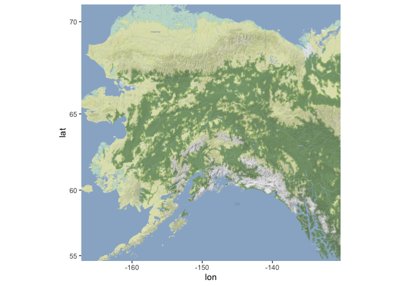
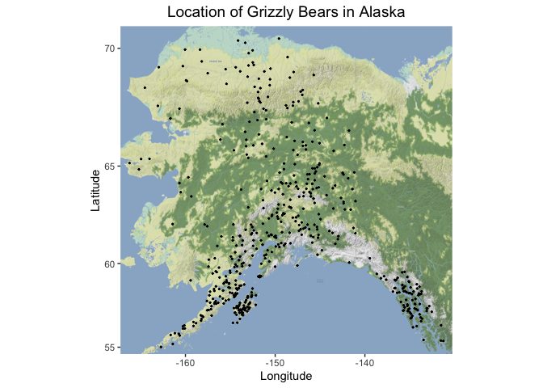
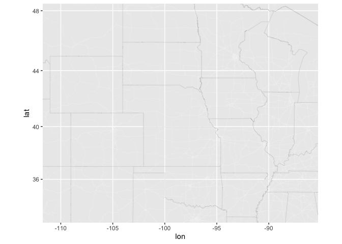
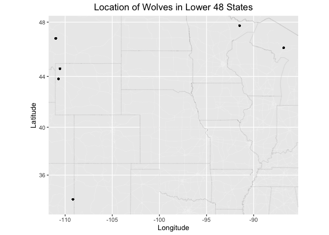
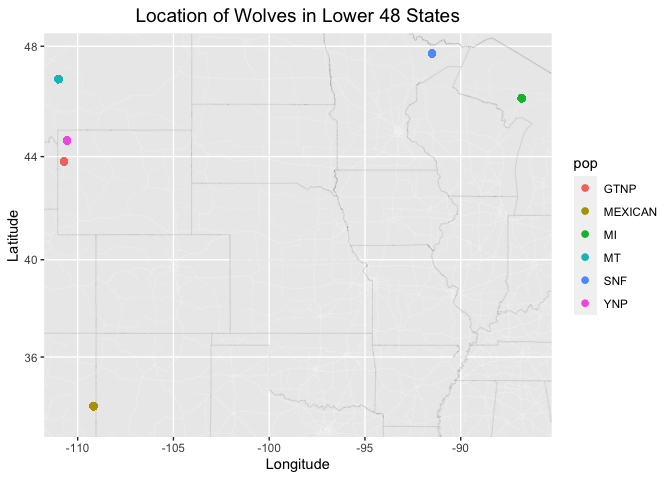

## Instructions    

Answer the following questions and complete the exercises in RMarkdown. Please embed all of your code and push your final work to your repository. Your final lab report should be organized, clean, and run free from errors. Remember, you must remove the `#` for the included code chunks to run. Be sure to add your name to the author header above. For any included plots, make sure they are clearly labeled. You are free to use any plot type that you feel best communicates the results of your analysis.  

Make sure to use the formatting conventions of RMarkdown to make your report neat and clean!  

## Load the libraries    


```r
library(tidyverse)
library(janitor)
library(ggmap)
```

## Load the Data.   

We will use two separate data sets for this homework.  

1. The first [data set](https://rcweb.dartmouth.edu/~f002d69/workshops/index_rspatial.html) represent sightings of grizzly bears (Ursos arctos) in Alaska.  

2. The second data set is from Brandell, Ellen E (2021), Serological dataset and R code for: Patterns and processes of pathogen exposure in gray wolves across North America, Dryad, [Dataset](https://doi.org/10.5061/dryad.5hqbzkh51).  

### 1. Load the `grizzly` data and evaluate its structure.  


```r
grizzly <- read_csv("data/bear-sightings.csv") %>% clean_names() #loading and tidying the data
```

```
## Rows: 494 Columns: 3
## ── Column specification ────────────────────────────────────────────────────────
## Delimiter: ","
## dbl (3): bear.id, longitude, latitude
## 
## ℹ Use `spec()` to retrieve the full column specification for this data.
## ℹ Specify the column types or set `show_col_types = FALSE` to quiet this message.
```

Evaluating the structure of the `grizzly` data:   


```r
glimpse(grizzly)
```

```
## Rows: 494
## Columns: 3
## $ bear_id   <dbl> 7, 57, 69, 75, 104, 108, 115, 116, 125, 135, 137, 162, 185, …
## $ longitude <dbl> -148.9560, -152.6228, -144.9374, -152.8485, -143.2948, -149.…
## $ latitude  <dbl> 62.65822, 58.35064, 62.38227, 59.90122, 61.07311, 62.91605, …
```

### 2. Use the range of the latitude and longitude to build an appropriate bounding box for your map.  

Determining the Range of Latitude and Longitude:   


```r
grizzly %>% 
  select(latitude, longitude) %>% 
  summary()
```

```
##     latitude       longitude     
##  Min.   :55.02   Min.   :-166.2  
##  1st Qu.:58.13   1st Qu.:-154.2  
##  Median :60.97   Median :-151.0  
##  Mean   :61.41   Mean   :-149.1  
##  3rd Qu.:64.13   3rd Qu.:-145.6  
##  Max.   :70.37   Max.   :-131.3
```

Building an Appropriate Bounding Box for the Map:    


```r
lat_grizzly <- c(55.02, 70.37)
long_grizzly <- c(-166.2, -131.3)
bbox_grizzly <- make_bbox(long_grizzly, lat_grizzly, f = 0.03)
```

### 3. Load a map from `stamen` in a terrain style projection and display the map.  


```r
map_grizzly <- get_stadiamap(bbox_grizzly, maptype = "stamen_terrain", zoom = 7) #loading the map
```

```
## ℹ © Stadia Maps © Stamen Design © OpenMapTiles © OpenStreetMap contributors.
```

```
## ℹ 196 tiles needed, this may take a while (try a smaller zoom?)
```


```r
ggmap(map_grizzly) #displaying the map
```

<!-- -->

### 4. Build a final map that overlays the recorded observations of grizzly bears in Alaska.  


```r
ggmap(map_grizzly) + #creating the map
  geom_point(data = grizzly, aes(longitude, latitude), size = 0.4) + #overlaying the recorded observations of grizzly bears in Alaska
  labs(x= "Longitude",
       y= "Latitude",
       title="Location of Grizzly Bears in Alaska") + #adding labels
  theme(plot.title = element_text(size = rel(1.3), hjust = 0.5)) #adjusting and moving labels
```

<!-- -->

Let's switch to the wolves data. Brandell, Ellen E (2021), Serological dataset and R code for: Patterns and processes of pathogen exposure in gray wolves across North America, Dryad, [Dataset](https://doi.org/10.5061/dryad.5hqbzkh51).  

### 5. Load the data and evaluate its structure.  


```r
wolves <- read_csv("data/wolves_data/wolves_dataset.csv") %>% clean_names() #loading and tidying the data
```

```
## Rows: 1986 Columns: 23
## ── Column specification ────────────────────────────────────────────────────────
## Delimiter: ","
## chr  (4): pop, age.cat, sex, color
## dbl (19): year, lat, long, habitat, human, pop.density, pack.size, standard....
## 
## ℹ Use `spec()` to retrieve the full column specification for this data.
## ℹ Specify the column types or set `show_col_types = FALSE` to quiet this message.
```

Evaluating the structure of the `wolves` data:   


```r
glimpse(wolves)
```

```
## Rows: 1,986
## Columns: 23
## $ pop                <chr> "AK.PEN", "AK.PEN", "AK.PEN", "AK.PEN", "AK.PEN", "…
## $ year               <dbl> 2006, 2006, 2006, 2006, 2006, 2006, 2006, 2006, 200…
## $ age_cat            <chr> "S", "S", "A", "S", "A", "A", "A", "P", "S", "P", "…
## $ sex                <chr> "F", "M", "F", "M", "M", "M", "F", "M", "F", "M", "…
## $ color              <chr> "G", "G", "G", "B", "B", "G", "G", "G", "G", "G", "…
## $ lat                <dbl> 57.03983, 57.03983, 57.03983, 57.03983, 57.03983, 5…
## $ long               <dbl> -157.8427, -157.8427, -157.8427, -157.8427, -157.84…
## $ habitat            <dbl> 254.08, 254.08, 254.08, 254.08, 254.08, 254.08, 254…
## $ human              <dbl> 10.42, 10.42, 10.42, 10.42, 10.42, 10.42, 10.42, 10…
## $ pop_density        <dbl> 8, 8, 8, 8, 8, 8, 8, 8, 8, 8, 8, 8, 8, 8, 8, 8, 8, …
## $ pack_size          <dbl> 8.78, 8.78, 8.78, 8.78, 8.78, 8.78, 8.78, 8.78, 8.7…
## $ standard_habitat   <dbl> -1.6339, -1.6339, -1.6339, -1.6339, -1.6339, -1.633…
## $ standard_human     <dbl> -0.9784, -0.9784, -0.9784, -0.9784, -0.9784, -0.978…
## $ standard_pop       <dbl> -0.6827, -0.6827, -0.6827, -0.6827, -0.6827, -0.682…
## $ standard_packsize  <dbl> 1.3157, 1.3157, 1.3157, 1.3157, 1.3157, 1.3157, 1.3…
## $ standard_latitude  <dbl> 0.7214, 0.7214, 0.7214, 0.7214, 0.7214, 0.7214, 0.7…
## $ standard_longitude <dbl> -2.1441, -2.1441, -2.1441, -2.1441, -2.1441, -2.144…
## $ cav_binary         <dbl> 1, 1, 1, 0, 1, 1, 1, 1, 1, 1, 1, 1, 1, 1, 1, 1, 1, …
## $ cdv_binary         <dbl> 0, 0, 0, 0, 0, 1, 0, 0, 0, 0, 0, 0, 0, 0, 0, 0, 0, …
## $ cpv_binary         <dbl> 0, 0, 1, 1, 0, 1, 0, 0, 0, 0, 1, 0, 0, 1, 0, 0, 0, …
## $ chv_binary         <dbl> 1, 1, 1, 1, 1, 1, 1, 1, 1, 0, 1, 1, 1, 1, 1, 1, 1, …
## $ neo_binary         <dbl> NA, NA, NA, 0, 0, NA, NA, 1, 0, 1, NA, 0, NA, NA, N…
## $ toxo_binary        <dbl> NA, NA, NA, 1, 0, NA, NA, 1, 0, 0, NA, 0, NA, NA, N…
```

### 6. How many distinct wolf populations are included in this study? Make a new object that restricts the data to the wolf populations in the lower 48 US states.  


```r
n_distinct(wolves$pop)
```

```
## [1] 17
```


```r
tabyl(wolves$pop)
```

```
##  wolves$pop   n     percent
##      AK.PEN 100 0.050352467
##     BAN.JAS  96 0.048338369
##          BC 145 0.073011078
##      DENALI 154 0.077542800
##       ELLES  11 0.005538771
##        GTNP  60 0.030211480
##      INT.AK  35 0.017623364
##     MEXICAN 181 0.091137966
##          MI 102 0.051359517
##          MT 351 0.176737160
##       N.NWT  67 0.033736153
##         ONT  60 0.030211480
##       SE.AK  10 0.005035247
##         SNF  92 0.046324270
##      SS.NWT  34 0.017119839
##         YNP 383 0.192849950
##        YUCH 105 0.052870091
```

#### There are 17 distinct wolf populations included in this study.   

Making a new object that restricts the data to the wolf populations in the lower 48 US states:   


```r
lower48_wolves <- wolves %>% 
  filter(lat > 25.84 , lat < 49.38) %>% 
  filter(long > -124.67 , long < -66.95) #filtering by the longitude and latitude of the boundary of the lower US states
```

### 7. Use the range of the latitude and longitude to build an appropriate bounding box for your map. 

Determining the Range of Latitude and Longitude:   


```r
lower48_wolves %>% 
  select(lat, long) %>% 
  summary()
```

```
##       lat             long        
##  Min.   :33.89   Min.   :-110.99  
##  1st Qu.:44.60   1st Qu.:-110.99  
##  Median :44.60   Median :-110.55  
##  Mean   :43.95   Mean   :-106.91  
##  3rd Qu.:46.83   3rd Qu.:-109.17  
##  Max.   :47.75   Max.   : -86.82
```

Building an Appropriate Bounding Box for the Map:   


```r
lat_wolves <- c(33.00, 48)
long_wolves <- c(-111.00, -86.00)
bbox_wolves <- make_bbox(long_wolves, lat_wolves, f = 0.03)
```

### 8.  Load a map from `stamen` in a `terrain-lines` projection and display the map.  


```r
map_wolves <- get_stadiamap(bbox_wolves, maptype = "stamen_terrain_lines", zoom = 7) #loading a map in the `terrain-lines` projection
```

```
## ℹ © Stadia Maps © Stamen Design © OpenMapTiles © OpenStreetMap contributors.
```

```
## ℹ 80 tiles needed, this may take a while (try a smaller zoom?)
```


```r
ggmap(map_wolves) #displaying the map
```

<!-- -->

### 9. Build a final map that overlays the recorded observations of wolves in the lower 48 states.  


```r
ggmap(map_wolves) + #creating the map
  geom_point(data = lower48_wolves, aes(long, lat), size = 0.8) + #overlaying the recorded observations of grizzly bears in Alaska
  labs(x= "Longitude",
       y= "Latitude",
       title="Location of Wolves in Lower 48 States") + #adding labels
  theme(plot.title = element_text(size = rel(1.3), hjust = 0.5)) #adjusting and moving labels
```

<!-- -->

### 10. Use the map from #9 above, but add some aesthetics. Try to `fill` and `color` by population.  


```r
ggmap(map_wolves) + #creating the map
  geom_point(data = lower48_wolves, aes(long, lat, fill = pop, color = pop), size = 2) + #overlaying the recorded observations of grizzly bears in Alaska
  labs(x= "Longitude",
       y= "Latitude",
       title="Location of Wolves in Lower 48 States") + #adding labels
  theme(plot.title = element_text(size = rel(1.3), hjust = 0.5)) #adjusting and moving labels
```

<!-- -->

## Push your final code to GitHub!
Please be sure that you check the `keep md` file in the knit preferences. 
