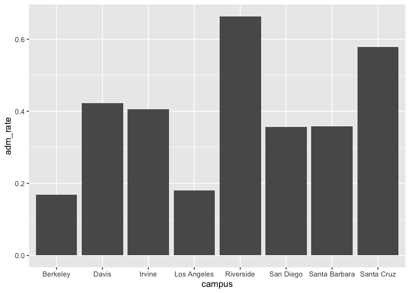

## Instructions    

Answer the following questions and complete the exercises in RMarkdown. Please embed all of your code and push your final work to your repository. Your final lab report should be organized, clean, and run free from errors. Remember, you must remove the `#` for the included code chunks to run. Be sure to add your name to the author header above.  

Make sure to use the formatting conventions of RMarkdown to make your report neat and clean!  

## Load the libraries    


```r
library(tidyverse)
library(janitor)
library(here)
library(naniar)
```

For this homework, we will take a departure from biological data and use data about California colleges. These data are a subset of the national college scorecard (https://collegescorecard.ed.gov/data/). Load the `ca_college_data.csv` as a new object called `colleges`.    


```r
colleges <- read_csv("data/ca_college_data.csv")
```

```
## Rows: 341 Columns: 10
## ── Column specification ────────────────────────────────────────────────────────
## Delimiter: ","
## chr (4): INSTNM, CITY, STABBR, ZIP
## dbl (6): ADM_RATE, SAT_AVG, PCIP26, COSTT4_A, C150_4_POOLED, PFTFTUG1_EF
## 
## ℹ Use `spec()` to retrieve the full column specification for this data.
## ℹ Specify the column types or set `show_col_types = FALSE` to quiet this message.
```
The variables are a bit hard to decipher, here is a key:  

INSTNM: Institution name  
CITY: California city  
STABBR: Location state  
ZIP: Zip code  
ADM_RATE: Admission rate  
SAT_AVG: SAT average score  
PCIP26: Percentage of degrees awarded in Biological And Biomedical Sciences  
COSTT4_A: Annual cost of attendance  
C150_4_POOLED: 4-year completion rate  
PFTFTUG1_EF: Percentage of undergraduate students who are first-time, full-time degree/certificate-seeking undergraduate students  

### 1. Use your preferred function(s) to have a look at the data and get an idea of its structure. Make sure you summarize NA's and determine whether or not the data are tidy. You may also consider dealing with any naming issues.    

#### Cleaning/Fixing the Variable Names:   


```r
colleges <- clean_names(colleges)
```

#### Looking at the data to get an idea of its structure:    


```r
glimpse(colleges)
```

```
## Rows: 341
## Columns: 10
## $ instnm        <chr> "Grossmont College", "College of the Sequoias", "College…
## $ city          <chr> "El Cajon", "Visalia", "San Mateo", "Ventura", "Oxnard",…
## $ stabbr        <chr> "CA", "CA", "CA", "CA", "CA", "CA", "CA", "CA", "CA", "C…
## $ zip           <chr> "92020-1799", "93277-2214", "94402-3784", "93003-3872", …
## $ adm_rate      <dbl> NA, NA, NA, NA, NA, NA, NA, NA, NA, NA, NA, NA, NA, NA, …
## $ sat_avg       <dbl> NA, NA, NA, NA, NA, NA, NA, NA, NA, NA, NA, NA, NA, NA, …
## $ pcip26        <dbl> 0.0016, 0.0066, 0.0038, 0.0035, 0.0085, 0.0151, 0.0000, …
## $ costt4_a      <dbl> 7956, 8109, 8278, 8407, 8516, 8577, 8580, 9181, 9281, 93…
## $ c150_4_pooled <dbl> NA, NA, NA, NA, NA, NA, 0.2334, NA, NA, NA, NA, 0.1704, …
## $ pftftug1_ef   <dbl> 0.3546, 0.5413, 0.3567, 0.3824, 0.2753, 0.4286, 0.2307, …
```

#### Summarizing NA's:    


```r
miss_var_summary(colleges)
```

```
## # A tibble: 10 × 3
##    variable      n_miss pct_miss
##    <chr>          <int>    <dbl>
##  1 sat_avg          276     80.9
##  2 adm_rate         240     70.4
##  3 c150_4_pooled    221     64.8
##  4 costt4_a         124     36.4
##  5 pftftug1_ef       53     15.5
##  6 pcip26            35     10.3
##  7 instnm             0      0  
##  8 city               0      0  
##  9 stabbr             0      0  
## 10 zip                0      0
```

#### Determining if the data is tidy:    

#### Since the variables have their own columns, each observation has its own row, and each value has its own cell, the data appears to be tidy.     


```r
colleges
```

```
## # A tibble: 341 × 10
##    instnm      city  stabbr zip   adm_rate sat_avg pcip26 costt4_a c150_4_pooled
##    <chr>       <chr> <chr>  <chr>    <dbl>   <dbl>  <dbl>    <dbl>         <dbl>
##  1 Grossmont … El C… CA     9202…       NA      NA 0.0016     7956        NA    
##  2 College of… Visa… CA     9327…       NA      NA 0.0066     8109        NA    
##  3 College of… San … CA     9440…       NA      NA 0.0038     8278        NA    
##  4 Ventura Co… Vent… CA     9300…       NA      NA 0.0035     8407        NA    
##  5 Oxnard Col… Oxna… CA     9303…       NA      NA 0.0085     8516        NA    
##  6 Moorpark C… Moor… CA     9302…       NA      NA 0.0151     8577        NA    
##  7 Skyline Co… San … CA     9406…       NA      NA 0          8580         0.233
##  8 Glendale C… Glen… CA     9120…       NA      NA 0.002      9181        NA    
##  9 Citrus Col… Glen… CA     9174…       NA      NA 0.0021     9281        NA    
## 10 Fresno Cit… Fres… CA     93741       NA      NA 0.0324     9370        NA    
## # ℹ 331 more rows
## # ℹ 1 more variable: pftftug1_ef <dbl>
```

#### 2. Which cities in California have the highest number of colleges?    


```r
colleges %>% 
  group_by(city) %>% #grouping by the variable city
  summarise(number_colleges = n()) %>% #finding the number of colleges per city
  arrange(desc(number_colleges)) #arranging from highest to lowest number of colleges in a city
```

```
## # A tibble: 161 × 2
##    city          number_colleges
##    <chr>                   <int>
##  1 Los Angeles                24
##  2 San Diego                  18
##  3 San Francisco              15
##  4 Sacramento                 10
##  5 Berkeley                    9
##  6 Oakland                     9
##  7 Claremont                   7
##  8 Pasadena                    6
##  9 Fresno                      5
## 10 Irvine                      5
## # ℹ 151 more rows
```

Using the head() argument to clearly visualize only the cities in California with the highest number of colleges:     


```r
colleges %>% 
  group_by(city) %>% #grouping by the variable city
  summarise(number_colleges = n()) %>% #finding the number of colleges per city
  arrange(desc(number_colleges)) %>% #arranging from highest to lowest number of colleges in a city
  head(10, number_colleges) #only listing the top 10 cities with the largest number of colleges
```

```
## # A tibble: 10 × 2
##    city          number_colleges
##    <chr>                   <int>
##  1 Los Angeles                24
##  2 San Diego                  18
##  3 San Francisco              15
##  4 Sacramento                 10
##  5 Berkeley                    9
##  6 Oakland                     9
##  7 Claremont                   7
##  8 Pasadena                    6
##  9 Fresno                      5
## 10 Irvine                      5
```

#### The cities with the highest numbers of colleges include Los Angeles (24), San Diego (18), and San Francisco (15).       

### 3. Based on your answer to #2, make a plot that shows the number of colleges in the top 10 cities.    


```r
colleges %>% 
  group_by(city) %>% #grouping by the variable city
  summarise(number_colleges = n()) %>% #finding the number of colleges per city
  arrange(desc(number_colleges)) %>% #arranging from highest to lowest number of colleges in a city
  head(10, number_colleges) %>% #only listing the top 10 cities with the largest number of colleges
  ggplot(aes(x = city, y = number_colleges)) + #creating the plot that shows the number of colleges in the top 10 cities
  geom_col() +
  coord_flip() #flipping the axes for ease of viewing
```

<!-- -->

### 4. The column `COSTT4_A` is the annual cost of each institution. Which city has the highest average cost? Where is it located?   


```r
colleges %>% 
  group_by(city) %>% #grouping by the variable city
  summarise(average_cost = mean(costt4_a, na.rm = T)) %>% #finding the average cost of institutions in each city
  arrange(desc(average_cost)) #arranging from highest to lowest average cost
```

```
## # A tibble: 161 × 2
##    city                average_cost
##    <chr>                      <dbl>
##  1 Claremont                  66498
##  2 Malibu                     66152
##  3 Valencia                   64686
##  4 Orange                     64501
##  5 Redlands                   61542
##  6 Moraga                     61095
##  7 Atherton                   56035
##  8 Thousand Oaks              54373
##  9 Rancho Palos Verdes        50758
## 10 La Verne                   50603
## # ℹ 151 more rows
```


```r
colleges %>% 
  filter(city == "Claremont") #filtering by the city that has the highest average cost
```

```
## # A tibble: 7 × 10
##   instnm      city  stabbr zip   adm_rate sat_avg  pcip26 costt4_a c150_4_pooled
##   <chr>       <chr> <chr>  <chr>    <dbl>   <dbl>   <dbl>    <dbl>         <dbl>
## 1 Pomona Col… Clar… CA     9171…   0.0944    1442  0.171     64870         0.957
## 2 Pitzer Col… Clar… CA     9171…   0.137       NA  0.0888    65880         0.888
## 3 Scripps Co… Clar… CA     9171…   0.299     1353  0.152     66060         0.871
## 4 Claremont … Clar… CA     9171…   0.0944    1413  0.0681    66325         0.924
## 5 Harvey Mud… Clar… CA     91711   0.129     1496  0.0674    69355         0.925
## 6 Claremont … Clar… CA     9171…  NA           NA NA            NA        NA    
## 7 Claremont … Clar… CA     9171…  NA           NA NA            NA        NA    
## # ℹ 1 more variable: pftftug1_ef <dbl>
```

#### Thus, the city with the highest average cost is Claremont with an average annual cost of $66498.00. It is located in California.   

### 5. Based on your answer to #4, make a plot that compares the cost of the individual colleges in the most expensive city. Bonus! Add UC Davis here to see how it compares :>).   


```r
colleges %>% 
  filter(city == "Claremont") %>% #filtering by only the most expensive city
  ggplot(aes(x = instnm, y = costt4_a)) + #creating the plot
  geom_col() +
  coord_flip() #flipping the axes for ease of viewing
```

```
## Warning: Removed 2 rows containing missing values (`position_stack()`).
```

<!-- -->


```r
colleges %>% 
  filter(city == "Claremont" | instnm == "University of California-Davis") %>% #filtering by the most expensive city and UC Davis, for comparison
  ggplot(aes(x = instnm, y = costt4_a)) + #creating the plot
  geom_col() +
  coord_flip() #flipping the axes for ease of viewing
```

```
## Warning: Removed 2 rows containing missing values (`position_stack()`).
```

<!-- -->

#### It appears, from the available data, that UC Davis has an annual cost that is almost half that of any of the colleges in the most expensive city, Claremont, CA.    

### 6. The column `ADM_RATE` is the admissions rate by college and `C150_4_POOLED` is the four-year completion rate. Use a scatterplot to show the relationship between these two variables. What do you think this means?    


```r
colleges %>% 
  ggplot(aes(y = c150_4_pooled, x = adm_rate)) + #creating the plot
  geom_point() + 
  geom_smooth(method = lm, se = T, na.rm = T) #adding a regression line
```

```
## `geom_smooth()` using formula = 'y ~ x'
```

```
## Warning: Removed 251 rows containing missing values (`geom_point()`).
```

<!-- -->

#### This plot appears to show that the HIGHER the admission rate of the college, the LOWER the four-year completion rate.

### 7. Is there a relationship between cost and four-year completion rate? (You don't need to do the stats, just produce a plot). What do you think this means?    


```r
colleges %>% 
  ggplot(aes(x = costt4_a, y = c150_4_pooled)) + #creating the plot
  geom_point() +
  geom_smooth(method = lm, se = T, na.rm = T) #adding a regression line
```

```
## `geom_smooth()` using formula = 'y ~ x'
```

```
## Warning: Removed 225 rows containing missing values (`geom_point()`).
```

<!-- -->

#### There DOES appear to be a relationship between cost and four-year completion rate. The plot above appears to show that the MORE expensive the school (annual cost), the LARGER the four-year completion rate.    

### 8. The column titled `INSTNM` is the institution name. We are only interested in the University of California colleges. Make a new data frame that is restricted to UC institutions. You can remove `Hastings College of Law` and `UC San Francisco` as we are only interested in undergraduate institutions.

Creating a data frame that is restricted to UC institutions:   


```r
uc_colleges <- colleges %>% 
  filter(grepl('University of California', instnm)) #filtering by only UC institutions
uc_colleges
```

```
## # A tibble: 10 × 10
##    instnm      city  stabbr zip   adm_rate sat_avg pcip26 costt4_a c150_4_pooled
##    <chr>       <chr> <chr>  <chr>    <dbl>   <dbl>  <dbl>    <dbl>         <dbl>
##  1 University… La J… CA     92093    0.357    1324  0.216    31043         0.872
##  2 University… Irvi… CA     92697    0.406    1206  0.107    31198         0.876
##  3 University… Rive… CA     92521    0.663    1078  0.149    31494         0.73 
##  4 University… Los … CA     9009…    0.180    1334  0.155    33078         0.911
##  5 University… Davis CA     9561…    0.423    1218  0.198    33904         0.850
##  6 University… Sant… CA     9506…    0.578    1201  0.193    34608         0.776
##  7 University… Berk… CA     94720    0.169    1422  0.105    34924         0.916
##  8 University… Sant… CA     93106    0.358    1281  0.108    34998         0.816
##  9 University… San … CA     9410…   NA          NA NA           NA        NA    
## 10 University… San … CA     9414…   NA          NA NA           NA        NA    
## # ℹ 1 more variable: pftftug1_ef <dbl>
```

Removing `Hastings College of Law` and `UC San Francisco` and storing the final data frame as a new object `univ_calif_final`:        


```r
univ_calif_final <- uc_colleges %>% 
  filter(instnm != "University of California-Hastings College of Law", instnm != "University of California-San Francisco") #removing the non-undergraduate institutions
univ_calif_final
```

```
## # A tibble: 8 × 10
##   instnm       city  stabbr zip   adm_rate sat_avg pcip26 costt4_a c150_4_pooled
##   <chr>        <chr> <chr>  <chr>    <dbl>   <dbl>  <dbl>    <dbl>         <dbl>
## 1 University … La J… CA     92093    0.357    1324  0.216    31043         0.872
## 2 University … Irvi… CA     92697    0.406    1206  0.107    31198         0.876
## 3 University … Rive… CA     92521    0.663    1078  0.149    31494         0.73 
## 4 University … Los … CA     9009…    0.180    1334  0.155    33078         0.911
## 5 University … Davis CA     9561…    0.423    1218  0.198    33904         0.850
## 6 University … Sant… CA     9506…    0.578    1201  0.193    34608         0.776
## 7 University … Berk… CA     94720    0.169    1422  0.105    34924         0.916
## 8 University … Sant… CA     93106    0.358    1281  0.108    34998         0.816
## # ℹ 1 more variable: pftftug1_ef <dbl>
```

Using `separate()` to separate institution name into two new columns "UNIV" and "CAMPUS":    


```r
univ_calif_final <- univ_calif_final %>% 
  separate(instnm, into = c("univ", "campus"), sep = "-")
univ_calif_final
```

```
## # A tibble: 8 × 11
##   univ  campus city  stabbr zip   adm_rate sat_avg pcip26 costt4_a c150_4_pooled
##   <chr> <chr>  <chr> <chr>  <chr>    <dbl>   <dbl>  <dbl>    <dbl>         <dbl>
## 1 Univ… San D… La J… CA     92093    0.357    1324  0.216    31043         0.872
## 2 Univ… Irvine Irvi… CA     92697    0.406    1206  0.107    31198         0.876
## 3 Univ… River… Rive… CA     92521    0.663    1078  0.149    31494         0.73 
## 4 Univ… Los A… Los … CA     9009…    0.180    1334  0.155    33078         0.911
## 5 Univ… Davis  Davis CA     9561…    0.423    1218  0.198    33904         0.850
## 6 Univ… Santa… Sant… CA     9506…    0.578    1201  0.193    34608         0.776
## 7 Univ… Berke… Berk… CA     94720    0.169    1422  0.105    34924         0.916
## 8 Univ… Santa… Sant… CA     93106    0.358    1281  0.108    34998         0.816
## # ℹ 1 more variable: pftftug1_ef <dbl>
```

### 9. The column `ADM_RATE` is the admissions rate by campus. Which UC has the lowest and highest admissions rates? Produce a numerical summary and an appropriate plot.   

#### Numerical Summary:    


```r
univ_calif_final %>% 
  summarise(min_adm_rate = min(adm_rate, na.rm = T),
            max_adm_rate = max(adm_rate, na.rm = T)) #summarizing the data based off of minimum and maximum admission rate values
```

```
## # A tibble: 1 × 2
##   min_adm_rate max_adm_rate
##          <dbl>        <dbl>
## 1        0.169        0.663
```

#### The UC with the lowest admission rate is UC Berkeley, with an admissions rate of 0.1693 (16.93%):       


```r
univ_calif_final %>% 
  filter(adm_rate == 0.1693) #filtering by the college with the lowest admission rate
```

```
## # A tibble: 1 × 11
##   univ  campus city  stabbr zip   adm_rate sat_avg pcip26 costt4_a c150_4_pooled
##   <chr> <chr>  <chr> <chr>  <chr>    <dbl>   <dbl>  <dbl>    <dbl>         <dbl>
## 1 Univ… Berke… Berk… CA     94720    0.169    1422  0.105    34924         0.916
## # ℹ 1 more variable: pftftug1_ef <dbl>
```

#### The UC with the highest admission rate is UC Riverside, with an admissions rate of 0.6634 (66.34%):       


```r
univ_calif_final %>% 
  filter(adm_rate == 0.6634) #filtering by the college with the highest admission rate
```

```
## # A tibble: 1 × 11
##   univ  campus city  stabbr zip   adm_rate sat_avg pcip26 costt4_a c150_4_pooled
##   <chr> <chr>  <chr> <chr>  <chr>    <dbl>   <dbl>  <dbl>    <dbl>         <dbl>
## 1 Univ… River… Rive… CA     92521    0.663    1078  0.149    31494          0.73
## # ℹ 1 more variable: pftftug1_ef <dbl>
```

#### Plot comparing the admissions rate by UC campus:    


```r
univ_calif_final %>% 
  ggplot(aes(x = campus, y = adm_rate)) +
  geom_col()
```

<!-- -->

### 10. If you wanted to get a degree in biological or biomedical sciences, which campus confers the majority of these degrees? Produce a numerical summary and an appropriate plot.    


```r
univ_calif_final %>%
  select(campus, pcip26) %>% #selecting by the variables of interest
  arrange(desc(pcip26)) #arranging from highest to lowest for ease of viewing
```

```
## # A tibble: 8 × 2
##   campus        pcip26
##   <chr>          <dbl>
## 1 San Diego      0.216
## 2 Davis          0.198
## 3 Santa Cruz     0.193
## 4 Los Angeles    0.155
## 5 Riverside      0.149
## 6 Santa Barbara  0.108
## 7 Irvine         0.107
## 8 Berkeley       0.105
```

#### Thus, the campus that confers the majority of the biological or biomedical sciences degrees is San Diego (0.2165).      

#### Plot showing which campus confers the majority of biological or biomedical sciences degrees:  


```r
univ_calif_final %>% 
  ggplot(aes(x = campus, y = pcip26)) +
  geom_col()
```

<!-- -->

## Knit Your Output and Post to [GitHub](https://github.com/FRS417-DataScienceBiologists)
