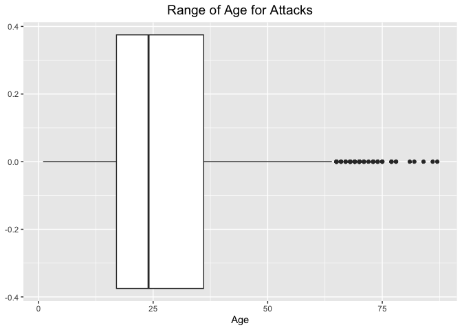
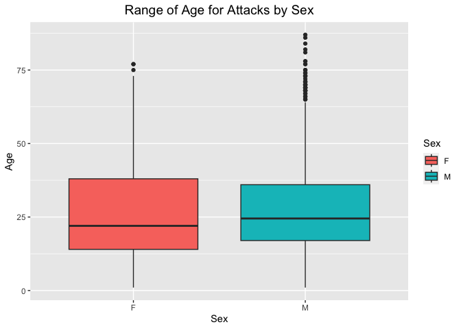

## Instructions
Answer the following questions and complete the exercises in RMarkdown. Please embed all of your code and push your final work to your repository. Your code must be organized, clean, and run free from errors. Remember, you must remove the `#` for any included code chunks to run. Be sure to add your name to the author header above. 

Your code must knit in order to be considered. If you are stuck and cannot answer a question, then comment out your code and knit the document.  

Don't forget to answer any questions that are asked in the prompt. Some questions will require a plot, but others do not- make sure to read each question carefully.  

For the questions that require a plot, make sure to have clearly labeled axes and a title. Keep your plots clean and professional-looking, but you are free to add color and other aesthetics.  

Be sure to follow the directions and push your code to your repository.

## Background   

In the `data` folder, you will find data about global shark attacks. The data are updated continuously, and are taken from [opendatasoft](https://public.opendatasoft.com/explore/dataset/global-shark-attack/table/?flg=en-us&disjunctive.country&disjunctive.area&disjunctive.activity).  

## Load the libraries  


```r
library("tidyverse")
library("janitor")
library("naniar")
```

## Load the data   

Run the following code chunk to import the data.  


```r
global_sharks <- read_csv("data/global-shark-attack.csv") %>% clean_names()
```

## Questions  

### 1. (2 points) Start by doing some data exploration using your preferred function(s). What is the structure of the data? Where are the missing values and how are they represented?  

The Data Structure:


```r
glimpse(global_sharks)
```

```
## Rows: 6,890
## Columns: 21
## $ date                   <date> 2023-07-29, 2023-04-22, 2023-03-02, 2023-02-18…
## $ year                   <dbl> 2023, 2023, 2023, 2023, 2022, 2022, 2021, 2021,…
## $ type                   <chr> "Unprovoked", "Unprovoked", "Unprovoked", "Ques…
## $ country                <chr> "USA", "AUSTRALIA", "SEYCHELLES", "ARGENTINA", …
## $ area                   <chr> "Florida", "Western Australia", "Praslin Island…
## $ location               <chr> "Tampa Bay", "Lucy's Beach", NA, "Chubut Provin…
## $ activity               <chr> "Swimming", "Surfing", "Snorkeling", NA, "Snork…
## $ name                   <chr> "Natalie Branda", "Max Marsden", "Arthur \xc9",…
## $ sex                    <chr> "F", "M", "M", "M", "F", "M", "M", "M", "M", "M…
## $ age                    <chr> "26", "30", "6", "32", NA, "21.0", "15.0", "73.…
## $ injury                 <chr> "Superficial injuries to abomen and thighs", "B…
## $ fatal_y_n              <chr> "N", "N", "UNKNOWN", "UNKNOWN", "N", "N", "N", …
## $ time                   <chr> "20h00", "07h15", "Afternoon", NA, "12h30", "15…
## $ species                <chr> NA, "Bronze whaler shark, 1.5 m", "Lemon shark"…
## $ investigator_or_source <chr> "Fox12, 8/1/2023", "The West Australian, 4/22/2…
## $ pdf                    <chr> NA, NA, NA, NA, "2022.07.28-Cornwall.pdf", "202…
## $ href_formula           <chr> NA, NA, NA, NA, "http://sharkattackfile.net/spr…
## $ href                   <chr> NA, NA, NA, NA, "http://sharkattackfile.net/spr…
## $ case_number_19         <chr> NA, NA, NA, NA, "2022.07.28", "2022.03.09", "20…
## $ case_number_20         <chr> NA, NA, NA, NA, "2022.7.28", "2022.03.09", "202…
## $ original_order         <dbl> NA, NA, NA, NA, 6792, 6743, 6720, 6626, 6618, 6…
```

How NA's Are Represented:   


```r
anyNA(global_sharks)
```

```
## [1] TRUE
```


```r
miss_var_summary(global_sharks)
```

```
## # A tibble: 21 × 3
##    variable n_miss pct_miss
##    <chr>     <int>    <dbl>
##  1 time       3518    51.1 
##  2 species    3118    45.3 
##  3 age        2982    43.3 
##  4 activity    586     8.51
##  5 sex         572     8.30
##  6 location    565     8.20
##  7 area        481     6.98
##  8 date        305     4.43
##  9 name        220     3.19
## 10 year        132     1.92
## # ℹ 11 more rows
```


```r
summary(global_sharks)
```

```
##       date                 year          type             country         
##  Min.   :1018-06-01   Min.   :   1   Length:6890        Length:6890       
##  1st Qu.:1951-08-16   1st Qu.:1950   Class :character   Class :character  
##  Median :1988-02-02   Median :1986   Mode  :character   Mode  :character  
##  Mean   :1973-01-14   Mean   :1971                                        
##  3rd Qu.:2009-08-30   3rd Qu.:2009                                        
##  Max.   :2023-08-16   Max.   :2023                                        
##  NA's   :305          NA's   :132                                         
##      area             location           activity             name          
##  Length:6890        Length:6890        Length:6890        Length:6890       
##  Class :character   Class :character   Class :character   Class :character  
##  Mode  :character   Mode  :character   Mode  :character   Mode  :character  
##                                                                             
##                                                                             
##                                                                             
##                                                                             
##      sex                age               injury           fatal_y_n        
##  Length:6890        Length:6890        Length:6890        Length:6890       
##  Class :character   Class :character   Class :character   Class :character  
##  Mode  :character   Mode  :character   Mode  :character   Mode  :character  
##                                                                             
##                                                                             
##                                                                             
##                                                                             
##      time             species          investigator_or_source
##  Length:6890        Length:6890        Length:6890           
##  Class :character   Class :character   Class :character      
##  Mode  :character   Mode  :character   Mode  :character      
##                                                              
##                                                              
##                                                              
##                                                              
##      pdf            href_formula           href           case_number_19    
##  Length:6890        Length:6890        Length:6890        Length:6890       
##  Class :character   Class :character   Class :character   Class :character  
##  Mode  :character   Mode  :character   Mode  :character   Mode  :character  
##                                                                             
##                                                                             
##                                                                             
##                                                                             
##  case_number_20     original_order
##  Length:6890        Min.   :   2  
##  Class :character   1st Qu.:1702  
##  Mode  :character   Median :3401  
##                     Mean   :3401  
##                     3rd Qu.:5100  
##                     Max.   :6802  
##                     NA's   :91
```

It appears that the missing values and NA's are represented by "NA" in this data set. I can also see that "N" and "." are used as placeholders for "NA" in the sex variable.     

### 2. (3 points) Are there any "hotspots" for shark incidents? Make a plot that shows the total number of incidents for the top 10 countries? Which country has the highest number of incidents?   

Plot with the Total Number of Incidents for the top 10 Countries:   


```r
global_sharks %>% 
        group_by(country) %>% 
        summarize(n_incidents = n()) %>% 
        arrange(desc(n_incidents)) %>% 
        head(10) %>% 
        ggplot(aes(x = reorder(country, n_incidents), y = n_incidents, fill = country)) + 
        geom_col() +
        coord_flip() +
        labs(title = "Number of Incidents for Top 10 Countries",
             x = "Country",
             y = "Number of Incidents",
             fill = "Country") +
        theme(plot.title = element_text(size = rel(1.3), hjust = 0.5))
```

<!-- -->


```r
global_sharks %>% 
        group_by(country) %>% 
        summarize(n_incidents = n()) %>% 
        arrange(desc(n_incidents)) %>% 
        head(10)
```

```
## # A tibble: 10 × 2
##    country          n_incidents
##    <chr>                  <int>
##  1 USA                     2522
##  2 AUSTRALIA               1464
##  3 SOUTH AFRICA             596
##  4 NEW ZEALAND              142
##  5 PAPUA NEW GUINEA         136
##  6 BAHAMAS                  132
##  7 BRAZIL                   122
##  8 MEXICO                   100
##  9 ITALY                     72
## 10 FIJI                      67
```

#### Yes, there are "hotspots" for shark incidents. The country with the highest number of incidents is thus USA with 2522 shark incidents.   

### 3. (3 points) Are there months of the year when incidents are more likely to occur? Make a plot that shows the total number of incidents by month. Which month has the highest number of incidents?   

Plot of Total Number of Incidents by Month:   


```r
global_sharks %>% 
        separate(date, into = c("year", "month", "day"), sep = "-") %>% 
        filter(month != "NA") %>% 
        group_by(month) %>% 
        summarize(n_incidents = n()) %>% 
        mutate(month = as.factor(month)) %>% 
        ggplot(aes(x = month, y = n_incidents, fill = month)) + 
        geom_col() +
        labs(title = "Number of Incidents by Month",
             x = "Month",
             y = "Number of Incidents",
             fill = "Month") +
        theme(plot.title = element_text(size = rel(1.3), hjust = 0.5))
```

<!-- -->


```r
global_sharks %>% 
        separate(date, into = c("year", "month", "day"), sep = "-") %>% 
        filter(month != "NA") %>% 
        group_by(month) %>% 
        summarize(n_incidents = n()) %>% 
        arrange(desc(n_incidents))
```

```
## # A tibble: 12 × 2
##    month n_incidents
##    <chr>       <int>
##  1 01            859
##  2 07            757
##  3 08            649
##  4 09            592
##  5 06            542
##  6 04            489
##  7 10            486
##  8 12            475
##  9 03            448
## 10 05            441
## 11 11            438
## 12 02            409
```


#### Yes, there are monthes of the year where shark incidents are more likely to occur. The month with the highest number of incidents is the first month of the year with 859 incidents.   

### 4. (3 points) Which activity is associated with the highest number of incidents? Make a plot that compares the top 5 riskiest activities. "NA" should not be classified as an activity.   

Plot that Compares the Top 5 Riskiest Activities:   


```r
global_sharks %>% 
        filter(activity != "NA") %>% 
        group_by(activity) %>% 
        summarize(n_incidents = n()) %>% 
        arrange(desc(n_incidents)) %>% 
        head(5) %>% 
        ggplot(aes(x = reorder(activity, n_incidents), y = n_incidents, fill = activity)) + 
        geom_col() +
        labs(title = "Number of Incidents by Activity",
             x = "Activity",
             y = "Number of Incidents",
             fill = "Activity") +
        theme(plot.title = element_text(size = rel(1.3), hjust = 0.5))
```

<!-- -->


```r
global_sharks %>% 
        filter(activity != "NA") %>% 
        group_by(activity) %>% 
        summarize(n_incidents = n()) %>% 
        arrange(desc(n_incidents)) %>% 
        head(5)
```

```
## # A tibble: 5 × 2
##   activity     n_incidents
##   <chr>              <int>
## 1 Surfing             1112
## 2 Swimming            1009
## 3 Fishing              498
## 4 Spearfishing         387
## 5 Wading               171
```

#### The riskiest activity is Surfing, with 1112 total shark incidents reported.    

### 5. (3 points) The data include information on who was attacked. Make a plot that shows the total number of fatalities by sex- are males or females more likely to be killed by sharks?   

Plot showing Total Number of Fatalities by Sex:  


```r
global_sharks %>% 
        filter(sex != "N", sex != ".") %>% 
        filter(fatal_y_n == "Y") %>% 
        group_by(sex) %>% 
        summarize(n_fatalities = n()) %>% 
        ggplot(aes(x = sex, y = n_fatalities, fill = sex)) + 
        geom_col() +
        labs(title = "Number of Fatalities by Sex",
             x = "Sex",
             y = "Number of Incidents",
             fill = "Sex") +
        theme(plot.title = element_text(size = rel(1.3), hjust = 0.5))
```

<!-- -->


```r
global_sharks %>% 
        filter(sex != "N", sex != ".") %>% 
        filter(fatal_y_n == "Y") %>% 
        count(sex) %>% 
        arrange(desc(n))
```

```
## # A tibble: 2 × 2
##   sex       n
##   <chr> <int>
## 1 M      1222
## 2 F       116
```

#### Thus males are more likely than females to be killed by sharks.   

### 6. (3 points) Make a plot that shows the range of age for the individuals that are attacked. Make sure to restrict sex to M or F (some of the codes used are not clear). You will also need to find a way to manage the messy age column.

Plot that Shows Range of Age of Attacked Individuals:   


```r
global_sharks %>% 
        filter(sex == "M" | sex == "F") %>% #restricting sex to M or F
        mutate(age = as.numeric(age)) %>% 
        filter(age != "NA") %>% 
        ggplot(aes(x = sex, y = age, fill = sex)) + 
        geom_boxplot() +
        labs(title = "Range of Age for Attacks",
             x = "Sex",
             y = "Age",
             fill = "Sex") +
        theme(plot.title = element_text(size = rel(1.3), hjust = 0.5))
```

```
## Warning: There was 1 warning in `mutate()`.
## ℹ In argument: `age = as.numeric(age)`.
## Caused by warning:
## ! NAs introduced by coercion
```

<!-- -->

### 7. (3 points) In the United States, what are the top 5 states where shark attacks have been recorded since 1950? Make a plot that compares the number of incidents for these 5 states.   

Plot that Compares the Number of Incidents for these Top 5 Shark Incident States:     


```r
global_sharks %>% 
        filter(country == "USA") %>% 
        separate(date, into = c("year", "month", "day"), sep = "-") %>% 
        filter(year >= "1950") %>% 
        count(area) %>% 
        arrange(desc(n)) %>% 
        head(5) %>% 
        ggplot(aes(x = reorder(area, n), y = n, fill = area)) +
        geom_col() +
        labs(title = "Top 5 US States for Shark Attacks",
             x = "US State",
             y = "Number of Incidents",
             fill = "US State") +
        theme(plot.title = element_text(size = rel(1.3), hjust = 0.5))
```

<!-- -->

#### Thus the top 5 states with the largest number of shark incidents since 1950 are North Carolina, South Carolina, Hawaii, California, and Florida.  

### 8. (3 points) Make a new object that limits the data to only include attacks attributed to Great White Sharks. This is trickier than it sounds, you should end up with 494 observations. Look online and adapt code involving `str_detect`. Which country has the highest number of Great White Shark attacks?   

Creating the New Object `great_white_sharks`:   


```r
great_white_sharks <- global_sharks %>% 
        filter(str_detect(.$species, "hite shark")) %>% 
        filter(species != "Mr. Burgess of ISAF announced the injury was the bite of a 1.8 m [6'], 2- to 3-year old white shark. Subsequent investigation revealed there was no shark involvem")
```


```r
great_white_sharks %>% 
        count(country) %>% 
        arrange(desc(n))
```

```
## # A tibble: 39 × 2
##    country          n
##    <chr>        <int>
##  1 USA            225
##  2 AUSTRALIA      175
##  3 SOUTH AFRICA   170
##  4 ITALY           26
##  5 NEW ZEALAND     20
##  6 CROATIA         11
##  7 CHILE            6
##  8 GREECE           5
##  9 JAPAN            4
## 10 BRAZIL           3
## # ℹ 29 more rows
```

#### Thus, the country with the largest number of Great White Shark attacks is the USA.   

### 9. (4 points) Use faceting to compare the number of fatal and non-fatal attacks for the top 5 countries with the highest number of Great White Shark attacks.   
 

```r
great_white_sharks %>% 
        filter(fatal_y_n == "Y" | fatal_y_n == "N") %>% 
        group_by(country) %>% 
        summarise(n_attacks = n()) %>% 
        arrange(desc(n_attacks)) %>% 
        head(5)
```

```
## # A tibble: 5 × 2
##   country      n_attacks
##   <chr>            <int>
## 1 USA                221
## 2 AUSTRALIA          172
## 3 SOUTH AFRICA       170
## 4 ITALY               24
## 5 NEW ZEALAND         20
```

Plot Comparing the number of Fatal versus Non-fatal attacks For the Top 5 Countries:   


```r
great_white_sharks %>% 
        filter(country == "USA" | country == "AUSTRALIA" | country == "SOUTH AFRICA" | country == "ITALY" | country == "NEW ZEALAND") %>% 
        filter(fatal_y_n == "Y" | fatal_y_n == "N") %>% 
        count(country, fatal_y_n) %>% 
        ggplot(aes(x = fatal_y_n, y = n, fill = fatal_y_n)) +
        geom_col() +
        facet_grid(~country) +
  labs(title = "Fatal and Non-fatal Attacks for the Top 5 Countries",
       x = "Fatal (Yes/No)",
       y = "Number of Incidents",
       fill = "Fatal (Yes/No)") +
  theme(plot.title = element_text(size = rel(1.3), hjust = 0.5))
```

<!-- -->

### 10. (3 points) Using the `global_sharks` data, what is one question that you are interested in exploring? Write the question and answer it using a plot or table.  

#### How does the number of provoked and unprovoked shark attacks compare by activity?   


```r
global_sharks %>% 
        filter(type == "Provoked" | type == "Unprovoked") %>% 
        filter(activity != "NA") %>% 
        count(activity) %>% 
        arrange(desc(n)) %>% 
        head(5) 
```

```
## # A tibble: 5 × 2
##   activity         n
##   <chr>        <int>
## 1 Surfing       1065
## 2 Swimming       909
## 3 Spearfishing   356
## 4 Fishing        349
## 5 Wading         160
```


```r
global_sharks %>% 
        filter(activity == "Surfing" | activity == "Swimming" | activity == "Spearfishing" | activity == "Fishing" | activity == "Wading") %>%
        filter(type == "Provoked" | type == "Unprovoked") %>% 
        ggplot(aes(x = activity, fill = type)) +
        geom_bar(position = "dodge") +
        labs(title = "Comparing Provocation Status and Number of Incidents by Activity",
        x = "Provoking Status",
        y = "Number of Incidents",
       fill = "Activity") +
        theme(plot.title = element_text(size = rel(1.3), hjust = 0.5))
```

<!-- -->

#### It seems that for most of these top dangerous activities, unprovoked attacks are more common, with the exception of Fishing.   
