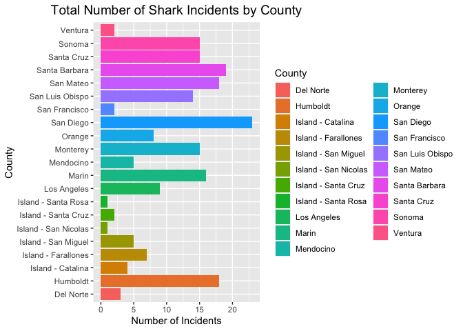
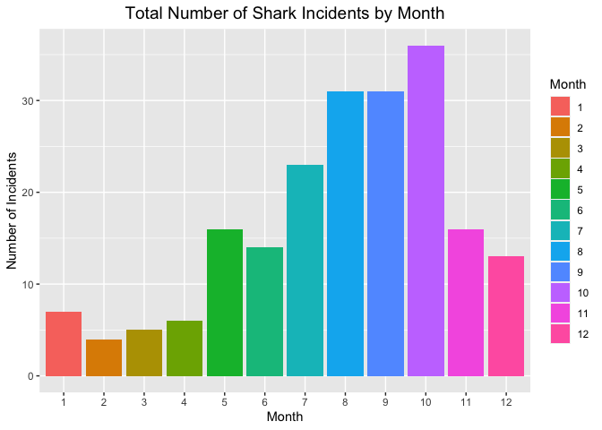
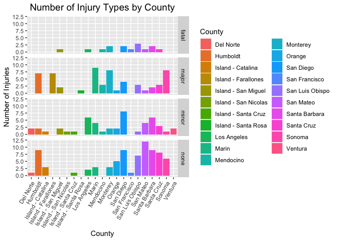
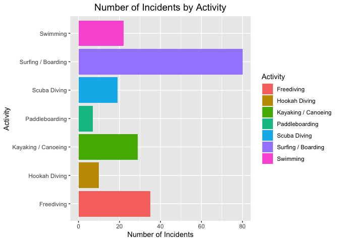
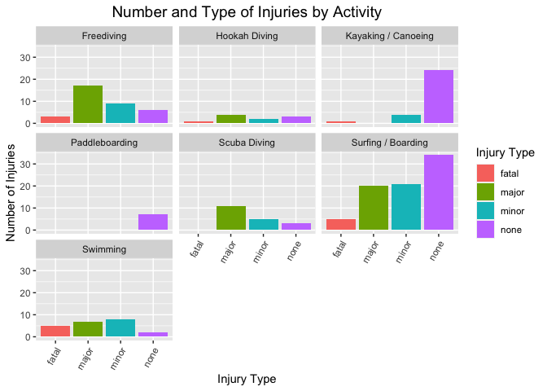
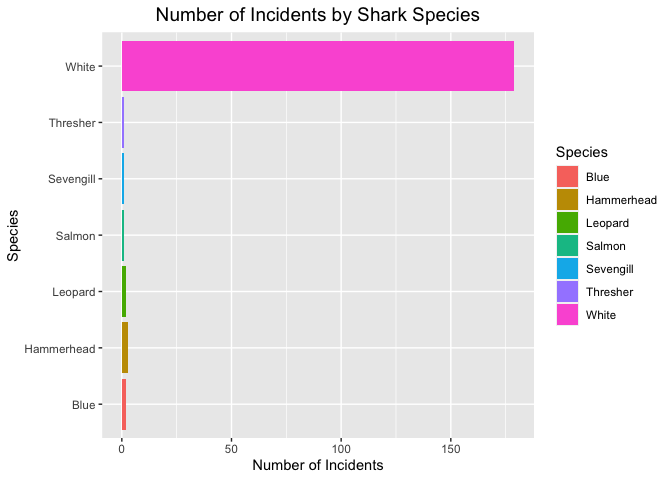
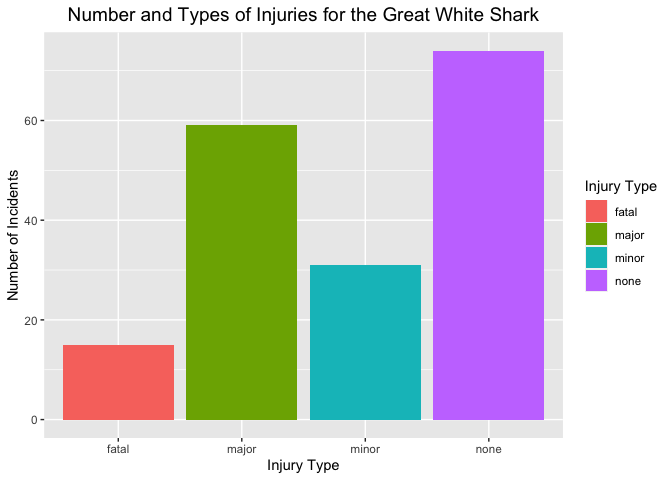
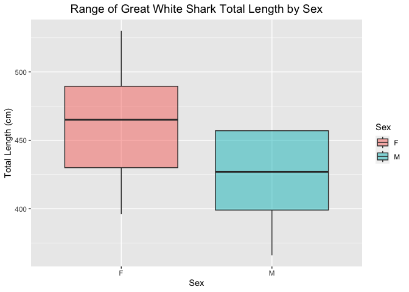
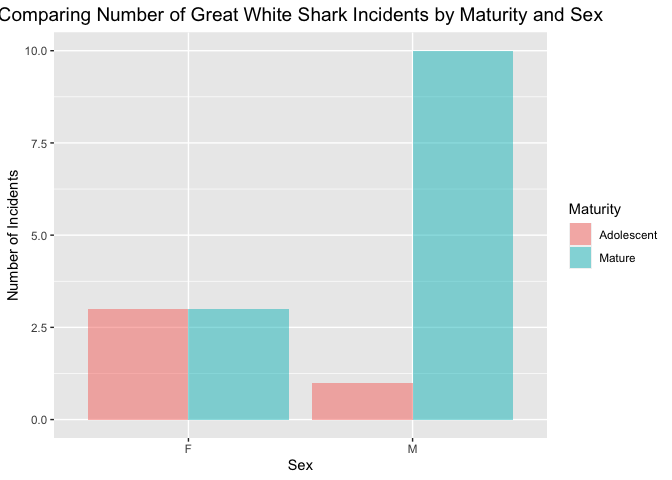

## Instructions
Answer the following questions and complete the exercises in RMarkdown. Please embed all of your code and push your final work to your repository. Your code must be organized, clean, and run free from errors. Remember, you must remove the `#` for any included code chunks to run. Be sure to add your name to the author header above. 

Your code must knit in order to be considered. If you are stuck and cannot answer a question, then comment out your code and knit the document. You may use your notes, labs, and homework to help you complete this exam. Do not use any other resources- including AI assistance.  

Don't forget to answer any questions that are asked in the prompt. Some questions will require a plot, but others do not- make sure to read each question carefully.  

For the questions that require a plot, make sure to have clearly labeled axes and a title. Keep your plots clean and professional-looking, but you are free to add color and other aesthetics.  

Be sure to follow the directions and upload your exam on Gradescope.    

## Background     

In the `data` folder, you will find data about shark incidents in California between 1950-2022. The [data](https://catalog.data.gov/dataset/shark-incident-database-california-56167) are from: State of California- Shark Incident Database.   

## Load the libraries  


```r
library("tidyverse")
library("janitor")
library("naniar")
```

## Load the data    

Run the following code chunk to import the data.    


```r
sharks <- read_csv("data/SharkIncidents_1950_2022_220302.csv") %>% clean_names()
```

## Questions   

### 1. (1 point) Start by doing some data exploration using your preferred function(s). What is the structure of the data? Where are the missing values and how are they represented?  

Structure of the Data:    


```r
glimpse(sharks)
```

```
## Rows: 211
## Columns: 16
## $ incident_num     <chr> "1", "2", "3", "4", "5", "6", "7", "8", "9", "10", "1…
## $ month            <dbl> 10, 5, 12, 2, 8, 4, 10, 5, 6, 7, 10, 11, 4, 5, 5, 8, …
## $ day              <dbl> 8, 27, 7, 6, 14, 28, 12, 7, 14, 28, 4, 10, 24, 19, 21…
## $ year             <dbl> 1950, 1952, 1952, 1955, 1956, 1957, 1958, 1959, 1959,…
## $ time             <chr> "12:00", "14:00", "14:00", "12:00", "16:30", "13:30",…
## $ county           <chr> "San Diego", "San Diego", "Monterey", "Monterey", "Sa…
## $ location         <chr> "Imperial Beach", "Imperial Beach", "Lovers Point", "…
## $ mode             <chr> "Swimming", "Swimming", "Swimming", "Freediving", "Sw…
## $ injury           <chr> "major", "minor", "fatal", "minor", "major", "fatal",…
## $ depth            <chr> "surface", "surface", "surface", "surface", "surface"…
## $ species          <chr> "White", "White", "White", "White", "White", "White",…
## $ comment          <chr> "Body Surfing, bit multiple times on leg, thigh and b…
## $ longitude        <chr> "-117.1466667", "-117.2466667", "-122.05", "-122.15",…
## $ latitude         <dbl> 32.58833, 32.58833, 36.62667, 36.62667, 35.13833, 35.…
## $ confirmed_source <chr> "Miller/Collier, Coronado Paper, Oceanside Paper", "G…
## $ wfl_case_number  <chr> NA, NA, NA, NA, NA, NA, NA, NA, NA, NA, NA, NA, NA, N…
```
How NA's Are Represented:    


```r
miss_var_summary(sharks)
```

```
## # A tibble: 16 × 3
##    variable         n_miss pct_miss
##    <chr>             <int>    <dbl>
##  1 wfl_case_number     202   95.7  
##  2 time                  7    3.32 
##  3 latitude              6    2.84 
##  4 longitude             5    2.37 
##  5 confirmed_source      1    0.474
##  6 incident_num          0    0    
##  7 month                 0    0    
##  8 day                   0    0    
##  9 year                  0    0    
## 10 county                0    0    
## 11 location              0    0    
## 12 mode                  0    0    
## 13 injury                0    0    
## 14 depth                 0    0    
## 15 species               0    0    
## 16 comment               0    0
```

The missing data is in the variables wfl_case_number, time latitude, longitude, and confirmed_source.    


```r
summary(sharks)
```

```
##  incident_num           month             day             year     
##  Length:211         Min.   : 1.000   Min.   : 1.00   Min.   :1950  
##  Class :character   1st Qu.: 6.000   1st Qu.: 7.50   1st Qu.:1985  
##  Mode  :character   Median : 8.000   Median :18.00   Median :2004  
##                     Mean   : 7.858   Mean   :16.54   Mean   :1998  
##                     3rd Qu.:10.000   3rd Qu.:25.00   3rd Qu.:2014  
##                     Max.   :12.000   Max.   :31.00   Max.   :2022  
##                                                                    
##      time              county            location             mode          
##  Length:211         Length:211         Length:211         Length:211        
##  Class :character   Class :character   Class :character   Class :character  
##  Mode  :character   Mode  :character   Mode  :character   Mode  :character  
##                                                                             
##                                                                             
##                                                                             
##                                                                             
##     injury             depth             species            comment         
##  Length:211         Length:211         Length:211         Length:211        
##  Class :character   Class :character   Class :character   Class :character  
##  Mode  :character   Mode  :character   Mode  :character   Mode  :character  
##                                                                             
##                                                                             
##                                                                             
##                                                                             
##   longitude            latitude     confirmed_source   wfl_case_number   
##  Length:211         Min.   :32.59   Length:211         Length:211        
##  Class :character   1st Qu.:34.04   Class :character   Class :character  
##  Mode  :character   Median :36.70   Mode  :character   Mode  :character  
##                     Mean   :36.36                                        
##                     3rd Qu.:38.18                                        
##                     Max.   :41.56                                        
##                     NA's   :6
```

It appears that the NA's (the missing values) are represented by NA, Unknown, and Unkown (which is probably a typo) in this data set.   

### 2. (1 point) Notice that there are some incidents identified as "NOT COUNTED". These should be removed from the data because they were either not sharks, unverified, or were provoked. It's OK to replace the `sharks` object.   


```r
sharks <- sharks %>% 
  filter(incident_num != "NOT COUNTED") #removing incidents identified as "NOT COUNTED" in the data
sharks
```

```
## # A tibble: 202 × 16
##    incident_num month   day  year time    county     location mode  injury depth
##    <chr>        <dbl> <dbl> <dbl> <chr>   <chr>      <chr>    <chr> <chr>  <chr>
##  1 1               10     8  1950 12:00   San Diego  Imperia… Swim… major  surf…
##  2 2                5    27  1952 14:00   San Diego  Imperia… Swim… minor  surf…
##  3 3               12     7  1952 14:00   Monterey   Lovers … Swim… fatal  surf…
##  4 4                2     6  1955 12:00   Monterey   Pacific… Free… minor  surf…
##  5 5                8    14  1956 16:30   San Luis … Pismo B… Swim… major  surf…
##  6 6                4    28  1957 13:30   San Luis … Morro B… Swim… fatal  surf…
##  7 7               10    12  1958 Unknown San Diego  Coronad… Swim… major  surf…
##  8 8                5     7  1959 17:30   San Franc… Baker B… Swim… fatal  surf…
##  9 9                6    14  1959 17:00   San Diego  La Jolla Free… fatal  surf…
## 10 10               7    28  1959 19:30   San Diego  La Jolla Free… minor  surf…
## # ℹ 192 more rows
## # ℹ 6 more variables: species <chr>, comment <chr>, longitude <chr>,
## #   latitude <dbl>, confirmed_source <chr>, wfl_case_number <chr>
```

### 3. (3 points) Are there any "hotspots" for shark incidents in California? Make a plot that shows the total number of incidents per county. Which county has the highest number of incidents?   


```r
sharks %>% 
  group_by(county) %>% 
  summarize(n_incidents = n()) %>% 
  arrange(desc(n_incidents))
```

```
## # A tibble: 21 × 2
##    county          n_incidents
##    <chr>                 <int>
##  1 San Diego                23
##  2 Santa Barbara            19
##  3 Humboldt                 18
##  4 San Mateo                18
##  5 Marin                    16
##  6 Monterey                 15
##  7 Santa Cruz               15
##  8 Sonoma                   15
##  9 San Luis Obispo          14
## 10 Los Angeles               9
## # ℹ 11 more rows
```

Plot that Shows the Total Number of Incidents per County:   


```r
sharks %>% 
  ggplot(aes(x = county, fill = county)) +
  geom_bar() +
  coord_flip() +
  labs(title = "Total Number of Shark Incidents by County",
       x = "County",
       y = "Number of Incidents",
       fill = "County") +
  theme(plot.title = element_text(size = rel(1.3), hjust = 0.5))
```

<!-- -->

#### It appears that the county of San Diego is a hotspot for shark injuries, with the highest total number of shark incidents in the dataset, 23.   

### 4. (3 points) Are there months of the year when incidents are more likely to occur? Make a plot that shows the total number of incidents by month. Which month has the highest number of incidents?    


```r
sharks %>% 
  group_by(month) %>% 
  summarize(n_incidents = n()) %>% 
  arrange(desc(n_incidents))
```

```
## # A tibble: 12 × 2
##    month n_incidents
##    <dbl>       <int>
##  1    10          36
##  2     8          31
##  3     9          31
##  4     7          23
##  5     5          16
##  6    11          16
##  7     6          14
##  8    12          13
##  9     1           7
## 10     4           6
## 11     3           5
## 12     2           4
```

Plot that Shows the Total Number of Incidents by Month:   


```r
sharks %>% 
  mutate(month = as.factor(month)) %>%
  ggplot(aes(x = month, fill = month)) +
  geom_bar() +
  labs(title = "Total Number of Shark Incidents by Month",
       x = "Month",
       y = "Number of Incidents",
       fill = "Month") +
  theme(plot.title = element_text(size = rel(1.3), hjust = 0.5))
```

<!-- -->

#### There DOES appear to be months in which more shark injuries occur. The month with the HIGHEST total number of shark incidents appears to be month 10 with 36 incidents.  

### 5. (3 points) How do the number and types of injuries compare by county? Make a table (not a plot) that shows the number of injury types by county. Which county has the highest number of fatalities?   

Table with Number and Types of Injuries by County:   


```r
sharks %>%
  count(injury, county) 
```

```
## # A tibble: 57 × 3
##    injury county                  n
##    <chr>  <chr>               <int>
##  1 fatal  Island - San Miguel     1
##  2 fatal  Los Angeles             1
##  3 fatal  Mendocino               1
##  4 fatal  Monterey                2
##  5 fatal  San Diego               2
##  6 fatal  San Francisco           1
##  7 fatal  San Luis Obispo         3
##  8 fatal  San Mateo               1
##  9 fatal  Santa Barbara           2
## 10 fatal  Santa Cruz              1
## # ℹ 47 more rows
```

Table with Number of Injury Types by County:   


```r
sharks %>%
  group_by(county) %>% 
  summarize(n_injury_types = n_distinct(injury)) #finding only the number of injury types represented for each county in the data
```

```
## # A tibble: 21 × 2
##    county               n_injury_types
##    <chr>                         <int>
##  1 Del Norte                         2
##  2 Humboldt                          3
##  3 Island - Catalina                 2
##  4 Island - Farallones               1
##  5 Island - San Miguel               3
##  6 Island - San Nicolas              1
##  7 Island - Santa Cruz               2
##  8 Island - Santa Rosa               1
##  9 Los Angeles                       3
## 10 Marin                             3
## # ℹ 11 more rows
```

Finding the Number of Fatalities per County:  


```r
sharks %>%
  filter(injury == "fatal") %>% 
  group_by(county) %>% 
  summarize(n_fatalities = n()) %>% 
  arrange(desc(n_fatalities))
```

```
## # A tibble: 10 × 2
##    county              n_fatalities
##    <chr>                      <int>
##  1 San Luis Obispo                3
##  2 Monterey                       2
##  3 San Diego                      2
##  4 Santa Barbara                  2
##  5 Island - San Miguel            1
##  6 Los Angeles                    1
##  7 Mendocino                      1
##  8 San Francisco                  1
##  9 San Mateo                      1
## 10 Santa Cruz                     1
```

Plot (Only For Visualization) with Number of Injury Types by County:   


```r
sharks %>% 
  ggplot(aes(x = county, fill = county)) +
  geom_bar() +
  facet_grid(injury~.) +
  labs(title = "Number of Injury Types by County",
       x = "County",
       y = "Number of Injuries",
       fill = "County") +
  theme(plot.title = element_text(size = rel(1.3), hjust = 0.5), axis.text.x = element_text(angle = 60, hjust = 1))  
```

<!-- -->

#### The county with the LARGEST number of fatalities is San Luis Obispo county, with 3 fatalities.   

### 6. (2 points) In the data, `mode` refers to a type of activity. Which activity is associated with the highest number of incidents?   


```r
sharks %>% 
  group_by(mode) %>% 
  summarize(n_incidents = n()) %>% 
  arrange(desc(n_incidents))
```

```
## # A tibble: 7 × 2
##   mode                n_incidents
##   <chr>                     <int>
## 1 Surfing / Boarding           80
## 2 Freediving                   35
## 3 Kayaking / Canoeing          29
## 4 Swimming                     22
## 5 Scuba Diving                 19
## 6 Hookah Diving                10
## 7 Paddleboarding                7
```


```r
sharks %>% 
  ggplot(aes(x = mode, fill = mode)) +
  geom_bar() +
  coord_flip() +
  labs(title = "Number of Incidents by Activity",
       x = "Activity",
       y = "Number of Incidents",
       fill = "Activity") +
  theme(plot.title = element_text(size = rel(1.3), hjust = 0.5))
```

<!-- -->

#### The activity associated with the HIGHEST number of shark incidents is Surfing / Boarding, with 80 shark incidents reported.   

### 7. (4 points) Use faceting to make a plot that compares the number and types of injuries by activity. (hint: the x axes should be the type of injury) 


```r
sharks %>% 
  ggplot(aes(x = injury, fill = injury)) +
  geom_bar() +
  facet_wrap(mode~.) +
  labs(title = "Number and Type of Injuries by Activity",
       x = "Injury Type",
       y = "Number of Injuries",
       fill = "Injury Type") +
  theme(plot.title = element_text(size = rel(1.3), hjust = 0.5), axis.text.x = element_text(angle = 60, hjust = 1))  
```

<!-- -->

### 8. (1 point) Which shark species is involved in the highest number of incidents?   


```r
sharks %>%
  group_by(species) %>% 
  summarize(n_incidents = n()) %>% 
  arrange(desc(n_incidents))
```

```
## # A tibble: 8 × 2
##   species    n_incidents
##   <chr>            <int>
## 1 White              179
## 2 Unknown             13
## 3 Hammerhead           3
## 4 Blue                 2
## 5 Leopard              2
## 6 Salmon               1
## 7 Sevengill            1
## 8 Thresher             1
```


```r
sharks %>% 
  filter(species != "Unknown") %>% 
  ggplot(aes(x = species, fill = species)) +
  geom_bar() +
  coord_flip() +
  labs(title = "Number of Incidents by Shark Species",
       x = "Species",
       y = "Number of Incidents",
       fill = "Species") +
  theme(plot.title = element_text(size = rel(1.3), hjust = 0.5))
```

<!-- -->

#### The shark species associated with the largest number of incidents is the "White" Shark (Great White Shark).    

### 9. (3 points) Are all incidents involving Great White's fatal? Make a plot that shows the number and types of injuries for Great White's only.  

Plot that Shows the Number and Type of Injuries for Great White's only:   


```r
sharks %>% 
  filter(species == "White") %>% #filtering by Great White sharks
  ggplot(aes(x = injury, fill = injury)) +
  geom_bar() +
  labs(title = "Number and Types of Injuries for the Great White Shark",
       x = "Injury Type",
       y = "Number of Incidents",
       fill = "Injury Type") +
  theme(plot.title = element_text(size = rel(1.3), hjust = 0.5))
```

<!-- -->

#### NO, NOT all of the incidents involving Great White Sharks are fatal. The Great White Shark actually caused more injuries that fell into the major, minor and none injury type categories than injuries that were fatal.    

## Background   

Let's learn a little bit more about Great White sharks by looking at a small dataset that tracked 20 Great White's in the Fallaron Islands. The [data](https://link.springer.com/article/10.1007/s00227-007-0739-4) are from: Weng et al. (2007) Migration and habitat of white sharks (_Carcharodon carcharias_) in the eastern Pacific Ocean.

## Load the data   


```r
white_sharks <- read_csv("data/White sharks tracked from Southeast Farallon Island, CA, USA, 1999 2004.csv", na = c("?", "n/a")) %>% clean_names()
```

### 10. (1 point) Start by doing some data exploration using your preferred function(s). What is the structure of the data? Where are the missing values and how are they represented?    

Structure of the Data:


```r
glimpse(white_sharks)
```

```
## Rows: 20
## Columns: 10
## $ shark           <chr> "1-M", "2-M", "3-M", "4-M", "5-F", "6-M", "7-F", "8-M"…
## $ tagging_date    <chr> "19-Oct-99", "30-Oct-99", "16-Oct-00", "5-Nov-01", "5-…
## $ total_length_cm <dbl> 402, 366, 457, 457, 488, 427, 442, 380, 450, 530, 427,…
## $ sex             <chr> "M", "M", "M", "M", "F", "M", "F", "M", "M", "F", NA, …
## $ maturity        <chr> "Mature", "Adolescent", "Mature", "Mature", "Mature", …
## $ pop_up_date     <chr> "2-Nov-99", "25-Nov-99", "16-Apr-01", "6-May-02", "19-…
## $ track_days      <dbl> 14, 26, 182, 182, 256, 275, 35, 60, 209, 91, 182, 240,…
## $ longitude       <dbl> -124.49, -125.97, -156.80, -141.47, -133.25, -138.83, …
## $ latitude        <dbl> 38.95, 38.69, 20.67, 26.39, 21.13, 26.50, 37.07, 34.93…
## $ comment         <chr> "Nearshore", "Nearshore", "To Hawaii", "To Hawaii", "O…
```

Finding the NA's:   


```r
miss_var_summary(white_sharks)
```

```
## # A tibble: 10 × 3
##    variable        n_miss pct_miss
##    <chr>            <int>    <dbl>
##  1 sex                  3       15
##  2 maturity             1        5
##  3 longitude            1        5
##  4 latitude             1        5
##  5 shark                0        0
##  6 tagging_date         0        0
##  7 total_length_cm      0        0
##  8 pop_up_date          0        0
##  9 track_days           0        0
## 10 comment              0        0
```

It appears that there are NA's in the sex, maturity, longitude, and latitude columns of the `white_sharks` dataset.    


```r
summary(white_sharks)
```

```
##     shark           tagging_date       total_length_cm     sex           
##  Length:20          Length:20          Min.   :360.0   Length:20         
##  Class :character   Class :character   1st Qu.:400.5   Class :character  
##  Mode  :character   Mode  :character   Median :434.5   Mode  :character  
##                                        Mean   :436.1                     
##                                        3rd Qu.:457.0                     
##                                        Max.   :530.0                     
##                                                                          
##    maturity         pop_up_date          track_days      longitude     
##  Length:20          Length:20          Min.   : 14.0   Min.   :-156.8  
##  Class :character   Class :character   1st Qu.: 85.0   1st Qu.:-137.8  
##  Mode  :character   Mode  :character   Median :182.0   Median :-133.2  
##                                        Mean   :166.8   Mean   :-120.3  
##                                        3rd Qu.:216.8   3rd Qu.:-124.3  
##                                        Max.   :367.0   Max.   : 131.7  
##                                                        NA's   :1       
##     latitude       comment         
##  Min.   :20.67   Length:20         
##  1st Qu.:22.48   Class :character  
##  Median :26.39   Mode  :character  
##  Mean   :28.24                     
##  3rd Qu.:36.00                     
##  Max.   :38.95                     
##  NA's   :1
```

It appears that NA's are represented by NAs in this dataset.   

### 11. (3 points) How do male and female sharks compare in terms of total length? Are males or females larger on average? Do a quick search online to verify your findings. (hint: this is a table, not a plot).  


```r
white_sharks %>% 
  filter(sex != "NA") %>% #removing the NA's in the sex column that I found in question 10
  group_by(sex) %>% 
  summarize(average_length = mean(total_length_cm, na.rm = T)) %>% 
  arrange(desc(average_length))
```

```
## # A tibble: 2 × 2
##   sex   average_length
##   <chr>          <dbl>
## 1 F               462 
## 2 M               425.
```

#### It appears that females are LARGER than males on average, with the females' average length of 462.0000	cm as compared to the males' average length of 425.0909	cm. Based on [Smithsonian's](https://ocean.si.edu/ocean-life/sharks-rays/how-big-are-great-white-sharks#:~:text=The%20average%20female%20is%2015,our%20great%20white%20shark%20overview.) page on  Great White Sharks that I found during my brief search, I can verify my findings - female great white sharks are larger than male great white sharks, with the average female great white sharks reaching 15-16 feet long, while the average males reaching 11-13 feet long.      

### 12. (3 points) Make a plot that compares the range of total length by sex.   

Plot that compares range of total length of Great White sharks by sex:   


```r
white_sharks %>% 
  filter(sex != "NA") %>% 
  ggplot(aes(x = sex, y = total_length_cm, fill = sex)) +
  geom_boxplot(alpha = 0.5) +
  labs(title = "Range of Great White Shark Total Length by Sex",
       x = "Sex",
       y = "Total Length (cm)",
       fill = "Sex") +
  theme(plot.title = element_text(size = rel(1.3), hjust = 0.5))
```

<!-- -->

### 13. (2 points) Using the `sharks` or the `white_sharks` data, what is one question that you are interested in exploring? Write the question and answer it using a plot or table.

#### One question that I am interested in exploring for the `white_sharks` dataset: What is the relationship between shark incident and maturity by sex - what sex and maturity level of Great White sharks is involved in the largest number of incidents?   


```r
white_sharks %>% 
  filter(maturity != "N/A", sex != "NA") %>% #removing the NA's from the data
  ggplot(aes(x = sex, fill = maturity)) +
  geom_bar(position = "dodge", alpha = 0.5) +
  theme_gray() +
  labs(title = "Comparing Number of Great White Shark Incidents by Maturity and Sex",
       x = "Sex",
       y = "Number of Incidents",
       fill = "Maturity") +
  theme(plot.title = element_text(size = rel(1.3), hjust = 0.5))
```

<!-- -->

#### It appears that mature, male great white sharks are responsible for the largest number of incidents.   

