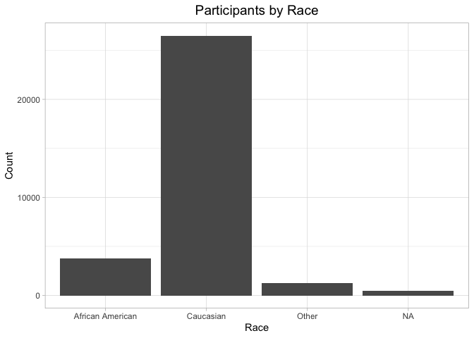
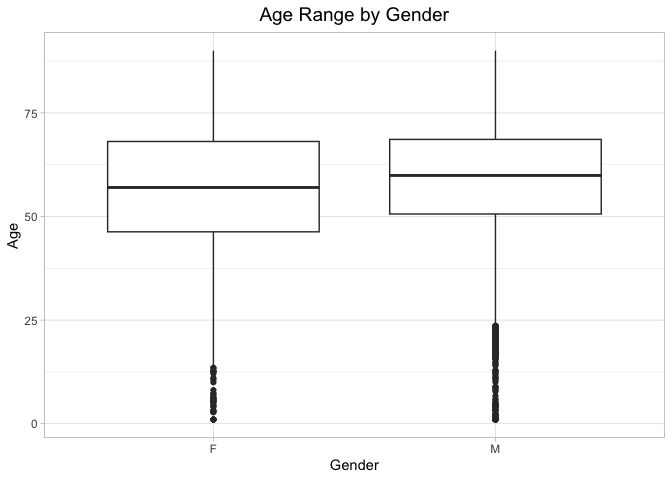
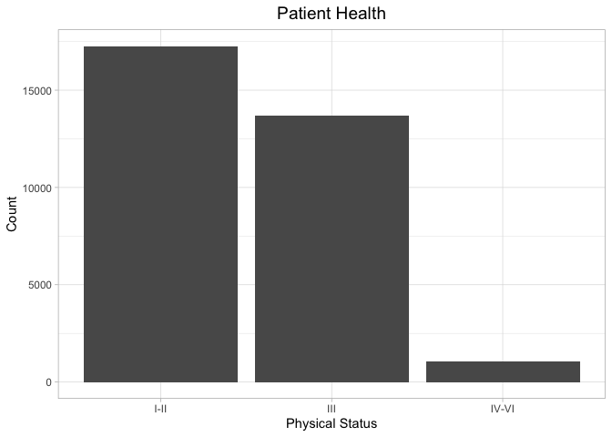
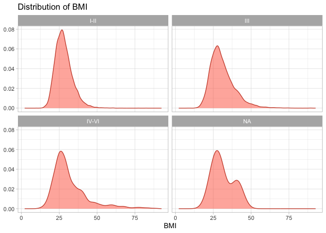
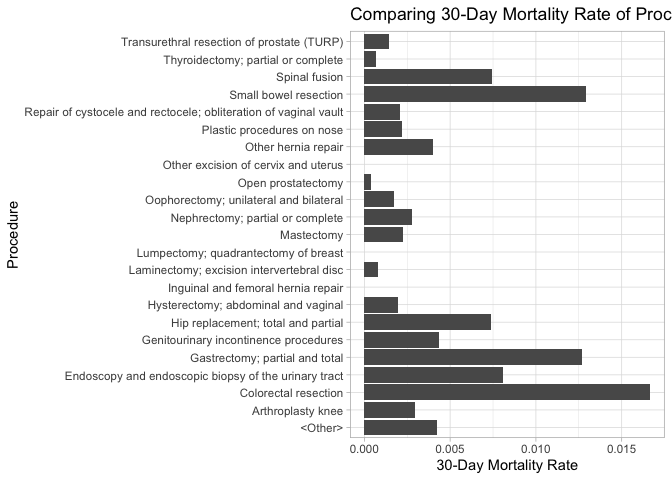
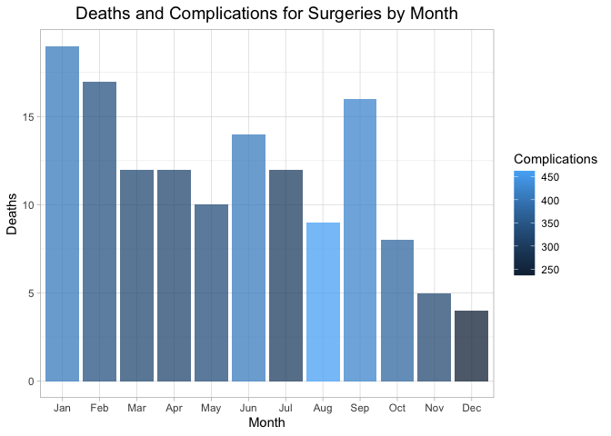

## Instructions
Answer the following questions and complete the exercises in RMarkdown. Please embed all of your code and push your final work to your repository. Your code should be organized, clean, and run free from errors. Remember, you must remove the `#` for any included code chunks to run. Be sure to add your name to the author header above.  

Make sure to use the formatting conventions of RMarkdown to make your report neat and clean! Use the tidyverse and pipes unless otherwise indicated. To receive full credit, all plots must have clearly labeled axes, a title, and consistent aesthetics. This exam is worth a total of 35 points. 

Please load the following libraries.

```r
library("tidyverse")
library("janitor")
library("naniar")
```

## Data
These data are from a study on surgical residents. The study was originally published by Sessier et al. “Operation Timing and 30-Day Mortality After Elective General Surgery”. Anesth Analg 2011; 113: 1423-8. The data were cleaned for instructional use by Amy S. Nowacki, “Surgery Timing Dataset”, TSHS Resources Portal (2016). Available at https://www.causeweb.org/tshs/surgery-timing/.

Descriptions of the variables and the study are included as pdf's in the data folder.  

Please run the following chunk to import the data.

```r
surgery <- read_csv("data/surgery.csv")
```

### 1. Use the summary function(s) of your choice to explore the data and get an idea of its structure. Please also check for NA's.  


```r
glimpse(surgery)
```

```
## Rows: 32,001
## Columns: 25
## $ ahrq_ccs            <chr> "<Other>", "<Other>", "<Other>", "<Other>", "<Othe…
## $ age                 <dbl> 67.8, 39.5, 56.5, 71.0, 56.3, 57.7, 56.6, 64.2, 66…
## $ gender              <chr> "M", "F", "F", "M", "M", "F", "M", "F", "M", "F", …
## $ race                <chr> "Caucasian", "Caucasian", "Caucasian", "Caucasian"…
## $ asa_status          <chr> "I-II", "I-II", "I-II", "III", "I-II", "I-II", "IV…
## $ bmi                 <dbl> 28.04, 37.85, 19.56, 32.22, 24.32, 40.30, 64.57, 4…
## $ baseline_cancer     <chr> "No", "No", "No", "No", "Yes", "No", "No", "No", "…
## $ baseline_cvd        <chr> "Yes", "Yes", "No", "Yes", "No", "Yes", "Yes", "Ye…
## $ baseline_dementia   <chr> "No", "No", "No", "No", "No", "No", "No", "No", "N…
## $ baseline_diabetes   <chr> "No", "No", "No", "No", "No", "No", "Yes", "No", "…
## $ baseline_digestive  <chr> "Yes", "No", "No", "No", "No", "No", "No", "No", "…
## $ baseline_osteoart   <chr> "No", "No", "No", "No", "No", "No", "No", "No", "N…
## $ baseline_psych      <chr> "No", "No", "No", "No", "No", "Yes", "No", "No", "…
## $ baseline_pulmonary  <chr> "No", "No", "No", "No", "No", "No", "No", "No", "N…
## $ baseline_charlson   <dbl> 0, 0, 0, 0, 0, 0, 2, 0, 1, 2, 0, 1, 0, 0, 0, 0, 0,…
## $ mortality_rsi       <dbl> -0.63, -0.63, -0.49, -1.38, 0.00, -0.77, -0.36, -0…
## $ complication_rsi    <dbl> -0.26, -0.26, 0.00, -1.15, 0.00, -0.84, -1.34, 0.0…
## $ ccsmort30rate       <dbl> 0.0042508, 0.0042508, 0.0042508, 0.0042508, 0.0042…
## $ ccscomplicationrate <dbl> 0.07226355, 0.07226355, 0.07226355, 0.07226355, 0.…
## $ hour                <dbl> 9.03, 18.48, 7.88, 8.80, 12.20, 7.67, 9.53, 7.52, …
## $ dow                 <chr> "Mon", "Wed", "Fri", "Wed", "Thu", "Thu", "Tue", "…
## $ month               <chr> "Nov", "Sep", "Aug", "Jun", "Aug", "Dec", "Apr", "…
## $ moonphase           <chr> "Full Moon", "New Moon", "Full Moon", "Last Quarte…
## $ mort30              <chr> "No", "No", "No", "No", "No", "No", "No", "No", "N…
## $ complication        <chr> "No", "No", "No", "No", "No", "No", "No", "Yes", "…
```

Checking for NA's:    


```r
anyNA(surgery)
```

```
## [1] TRUE
```


```r
miss_var_summary(surgery)
```

```
## # A tibble: 25 × 3
##    variable          n_miss pct_miss
##    <chr>              <int>    <dbl>
##  1 bmi                 3290 10.3    
##  2 race                 480  1.50   
##  3 asa_status             8  0.0250 
##  4 gender                 3  0.00937
##  5 age                    2  0.00625
##  6 ahrq_ccs               0  0      
##  7 baseline_cancer        0  0      
##  8 baseline_cvd           0  0      
##  9 baseline_dementia      0  0      
## 10 baseline_diabetes      0  0      
## # ℹ 15 more rows
```

### 2. Let's explore the participants in the study. Show a count of participants by race AND make a plot that visually represents your output.    

Count of Participants by Race:   


```r
surgery %>% 
        count(race)
```

```
## # A tibble: 4 × 2
##   race                 n
##   <chr>            <int>
## 1 African American  3790
## 2 Caucasian        26488
## 3 Other             1243
## 4 <NA>               480
```

Plot that Visually Represents the Counts:    


```r
surgery %>% 
        ggplot(aes(x = race)) +
        geom_bar() +
        theme_light() +
        labs(title = "Participants by Race",
             x = "Race",
             y = "Count") +
        theme(plot.title = element_text(size = rel(1.3), hjust = 0.5))
```

<!-- -->


### 3. What is the mean age of participants by gender? (hint: please provide a number for each) Since only three participants do not have gender indicated, remove these participants from the data.    


```r
surgery %>% 
        filter(gender != "NA") %>% 
        group_by(gender) %>% 
        summarize(mean_age = mean(age, na.rm = T))
```

```
## # A tibble: 2 × 2
##   gender mean_age
##   <chr>     <dbl>
## 1 F          56.7
## 2 M          58.8
```

#### The mean age of the females in this data set is 56.70730 years, and the mean age of the males in the data set is 58.77323 years.    

### #4. Make a plot that shows the range of age associated with gender.    


```r
surgery %>% 
        filter(gender != "NA") %>% 
        ggplot(aes(x = gender, y = age)) +
        geom_boxplot(na.rm = T) +
        theme_light() +
        labs(title = "Age Range by Gender",
             x = "Gender",
             y = "Age") +
        theme(plot.title = element_text(size = rel(1.3), hjust = 0.5))
```

<!-- -->

### 5. How healthy are the participants? The variable `asa_status` is an evaluation of patient physical status prior to surgery. Lower numbers indicate fewer comorbidities (presence of two or more diseases or medical conditions in a patient). Make a plot that compares the number of `asa_status` I-II, III, and IV-V.   


```r
surgery %>%
        filter(asa_status != "NA") %>% 
        ggplot(aes(x = asa_status)) +
        geom_bar() +
        theme_light() +
        labs(title = "Patient Health",
             x = "Physical Status",
             y = "Count") +
        theme(plot.title = element_text(size = rel(1.3), hjust = 0.5))
```

<!-- -->

### 6. Create a plot that displays the distribution of body mass index for each `asa_status` as a probability distribution- not a histogram. (hint: use faceting!).  


```r
surgery %>% 
        ggplot(aes(x = bmi)) + 
        geom_density(color = "tomato3", fill = "tomato", alpha = 0.5, na.rm = T) +
        facet_wrap(~asa_status) +
        labs(title = "Distribution of BMI",
             x = "BMI",
             y = NULL) +
        theme(plot.title = element_text(size = rel(1.3))) +
        theme_light()
```

<!-- -->

The variable `ccsmort30rate` is a measure of the overall 30-day mortality rate associated with each type of operation. The variable `ccscomplicationrate` is a measure of the 30-day in-hospital complication rate. The variable `ahrq_ccs` lists each type of operation.  

### 7. What are the 5 procedures associated with highest risk of 30-day mortality AND how do they compare with the 5 procedures with highest risk of complication? (hint: no need for a plot here).  


```r
surgery %>% 
        group_by(ahrq_ccs) %>% 
        summarize(average_ccsmort30rate = mean(ccsmort30rate, na.rm = T)) %>% 
        arrange(desc(average_ccsmort30rate)) %>% 
        head(5)
```

```
## # A tibble: 5 × 2
##   ahrq_ccs                                             average_ccsmort30rate
##   <chr>                                                                <dbl>
## 1 Colorectal resection                                               0.0167 
## 2 Small bowel resection                                              0.0129 
## 3 Gastrectomy; partial and total                                     0.0127 
## 4 Endoscopy and endoscopic biopsy of the urinary tract               0.00811
## 5 Spinal fusion                                                      0.00742
```


```r
surgery %>% 
        group_by(ahrq_ccs) %>% 
        summarize(average_ccscomplicationrate = mean(ccscomplicationrate, na.rm = T)) %>% 
        arrange(desc(average_ccscomplicationrate)) %>% 
        head(5)
```

```
## # A tibble: 5 × 2
##   ahrq_ccs                         average_ccscomplicationrate
##   <chr>                                                  <dbl>
## 1 Small bowel resection                                  0.466
## 2 Colorectal resection                                   0.312
## 3 Nephrectomy; partial or complete                       0.197
## 4 Gastrectomy; partial and total                         0.190
## 5 Spinal fusion                                          0.183
```

#### It appears that the 5 procedures with the highest risk of 30-day mortality overlap with the 5 procedures with the highest risk of complication.    

### 8. Make a plot that compares the `ccsmort30rate` for all listed `ahrq_ccs` procedures.   


```r
surgery %>% 
        group_by(ahrq_ccs) %>% 
        summarize(average_ccsmort30rate = mean(ccsmort30rate, na.rm = T)) %>% 
        ggplot(aes(x = ahrq_ccs, y = average_ccsmort30rate)) +
        geom_col() +
        coord_flip() +
        labs(title = "Comparing 30-Day Mortality Rate of Procedures",
             x = "Procedure",
             y = "30-Day Mortality Rate") +
        theme(plot.title = element_text(size = rel(1.2), hjust = 0.5)) +
        theme_light()
```

<!-- -->

### 9. When is the best month to have surgery? Make a chart that shows the 30-day mortality and complications for the patients by month. `mort30` is the variable that shows whether or not a patient survived 30 days post-operation.    


```r
surgery_month <- surgery %>% 
        mutate(mort30_n = ifelse(mort30 == "Yes", 1, 0),
               complication_n = ifelse(complication == "Yes", 1, 0)) %>% 
        group_by(month) %>% 
        summarize(n_deaths = sum(mort30_n, na.rm = T),
                  n_complication = sum(complication_n, na.rm = T))
surgery_month
```

```
## # A tibble: 12 × 3
##    month n_deaths n_complication
##    <chr>    <dbl>          <dbl>
##  1 Apr         12            321
##  2 Aug          9            462
##  3 Dec          4            237
##  4 Feb         17            343
##  5 Jan         19            407
##  6 Jul         12            301
##  7 Jun         14            410
##  8 Mar         12            324
##  9 May         10            333
## 10 Nov          5            325
## 11 Oct          8            377
## 12 Sep         16            424
```

#### Therefore, the best month to have a surgery appears to be December.    

### 10. Make a plot that visualizes the chart from question #9. Make sure that the months are on the x-axis. Do a search online and figure out how to order the months Jan-Dec.


```r
surgery_month %>% 
        ggplot(aes(x = month, y = n_deaths, fill = n_complication)) +
        geom_col(alpha = 0.75) +
        theme_light() +
        labs(title = "Deaths and Complications for Surgeries by Month",
             x = "Month",
             y = "Deaths",
             fill = "Complications") +
        theme(plot.title = element_text(size = rel(1.3), hjust = 0.5)) +
        scale_x_discrete(limits = month.abb)
```

<!-- -->

Please be 100% sure your exam is saved, knitted, and pushed to your github repository. No need to submit a link on canvas, we will find your exam in your repository.
